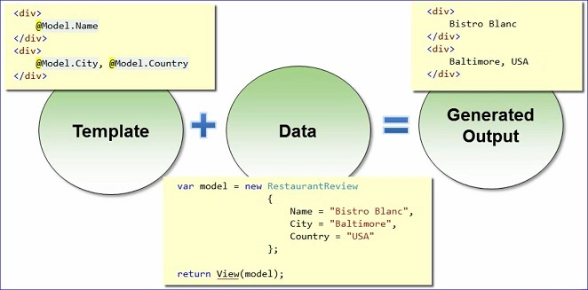

#Razor Basics
The Razor View engine allows us to use Razor templates to produce HTML.  Razor views have a .cshtml extension.  Templates consisting of markup.


#Code Expressions
The @ symbol tells the application that we are introducing C# code and evaluates to HTML.

<b>For example:</b>
```csharp
We are using the latest @Model.Count() reviews  //returns something like: We are using the latest 3 reviews
@VirtualPath //returns something like: ~/Views/reviews/Index.cshtml.  The ~ symbol indicates the root of the application.
@item.rating / 10 //returns 10 / 10
@(item.rating / 10) //returns the division of item.rating / 10
R@item.Rating //returns R@item.Rating
R@(item.Rating) //returns R10
@twitterhandle //returns an error
@@twitterhandle //returns @twitterhandle.  The double @ escapes the @ and returns it.
@:text //@: tells razor that the next word is literal text
```

#Code Blocks
Razor supports code blocks as well as implicit and explicit code expressions.  
<b>Example</b>
```csharp
//remember it is a good idea to keep views simple; therefore, a lot of code in a code block violates that thought process
@{
	ViewBag.Title="Index";
}

@foreach (var item in Model)
{
	<div class="review">
		<h4>@item.Name</h4>
		<span>@item.Rating</span>
		<p>@item.City, @item.Country</p>
	</div>
}
```
###With some CSS entries the above code might look like this:


#Layout Views
The Layout View controls items on the page that will be common across the site:  


#HTML Helpers
The purpose of an HTML helper is to create small blocks of HTML  
- HTML is a property of the ViewPage base class
 - Create inputs
 - Create links
 - Create forms  
 


#Partial Views
Partial views allow for reusing code on different pages