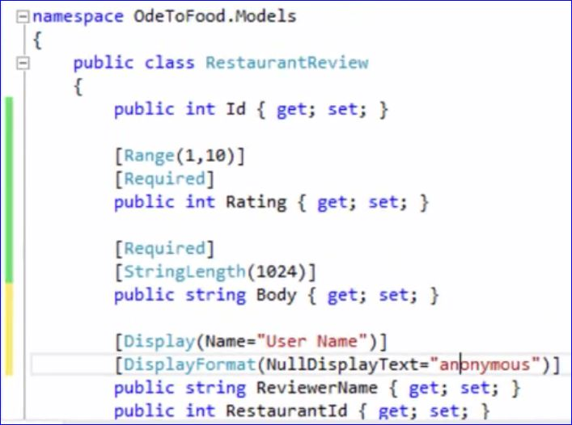

#Validation Annotation
Add annotations to required fields and not allow a null value, limit the range of integers allowed, the length a string might be or other options.  
Annotation can also be added to tell the framework how to display and what to do in the case of a null value.  
The following shows how:  
