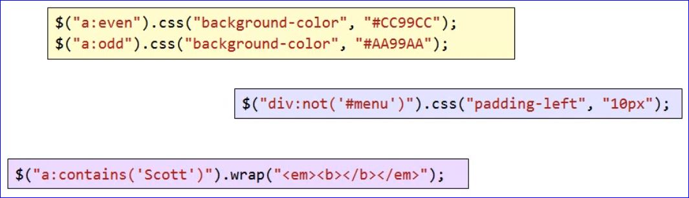

# ASP.NET and JQuery

## $ function

### $ is the JQuery function

- Returns a jQuery object
- $ is "overloaded" to perform different tasks

### Analyzes incoming arguments

- String (selector expression to select elements)
- String (containing HTML for manipulation)
- DOM elements (to bind events or set properties)
- Function object (invoked on document ready)

#### Example 1

```javascript
//This is essentially the same thing as on "page load" however, it is referred to as document ready
$(function()){
    //this will append a div with Hello World wrapped in the div to the body of the document
    $("<div>Hello. World</div>").appendTo(document.body);
    //this will wrap whatever text is wrapped by the div with an h1 tag
    $("div").wrapInnter("<h1></h1>");
}
```

## Selectors

### Selectors find DOM elements to manipulate

- Based on CSS Selector syntax
- Find by id, class, element name and hierarchical positioning

### Selectors return a sequence of matching DOM elements

- Later methods operate on every matched element
- Like LINQ, can then create processing pipeline

#### Example 2


Full list: [Full List Reference](http://www.w3.org/TR/css3-selectors/)

## Selector Pseudo-classes

### Further refinement of a selection

- Always starts with a colon (:)
- Examples include :link, :visited, :odd, :even, :not, :first

#### Example 3



## Working with Attributes

### The attr() function

- Reads a property value from first matched element
- Set one or more properties on all matched elements

### Class functions

- addClass()
- removeClass()
- toggleClass()

### Others

- html()
- val()
- text()

#### Example 4


## Chaining

### jQuery uses a builder design pattern

- Each method call returns the jQuery object
- Continue to work with the sequence of matched elements by chaining method calls
- The **end()** function reverts last "destructive" filter

#### Example 5


## Effects

### Basics

- hide, show, toggle

### Sliding

- slideUp, slideDown, slideToggle

### Fading

- fadeIn, fadeOut, fadeTo

#### Custom animate function


## Server Communication

### High level options

- load()
- get()
- post()
- getJSON()

### Low level options

- ajax()


## Using get() and post()

- Allows accessess to raw XmlHTTPRequest object
- Packaghes data into query string (GET) or form values (POST)
- Callback function invoked to process result
  - Only invoked on successful completion

#### Example 6


## Error Handling

### Need to use lower level ajax() method or ajaxError() method

### With ajax() method, single parameter specifies all options

- Includes success and error callback functions

#### Example 7


## Global AJAX Events

### Local events are callbacks for specific AJAX calls

### Global events raised for all JQuery AJAX calls

- Can disable on a per-call basis

#### Example 8


## Calling WCF Services

