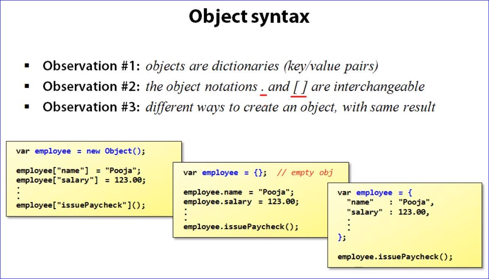
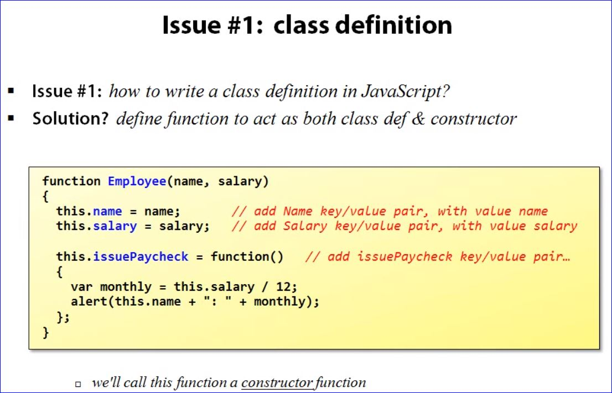
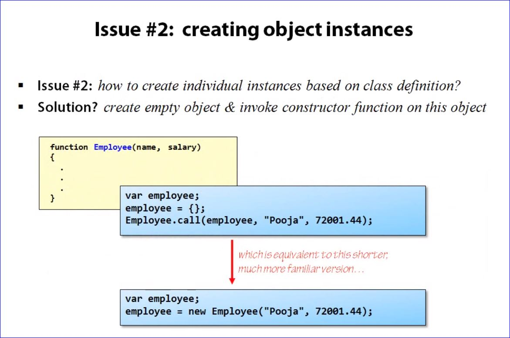
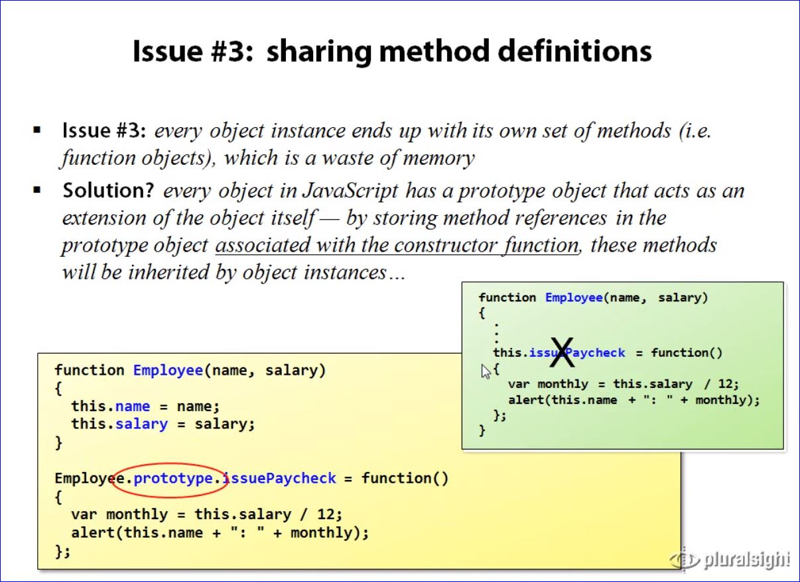
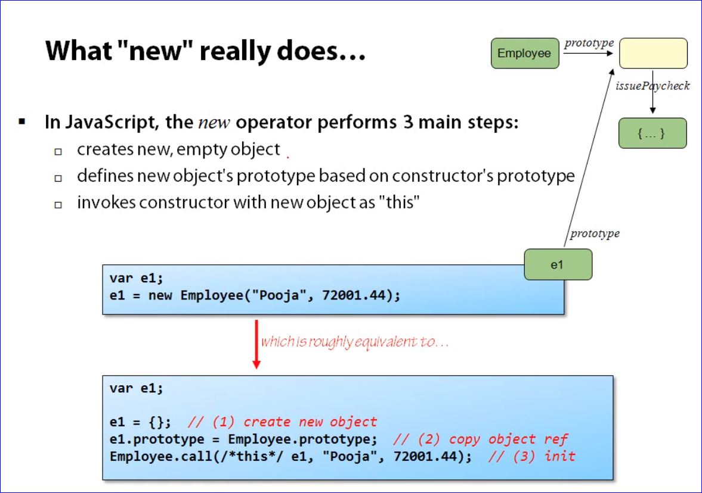
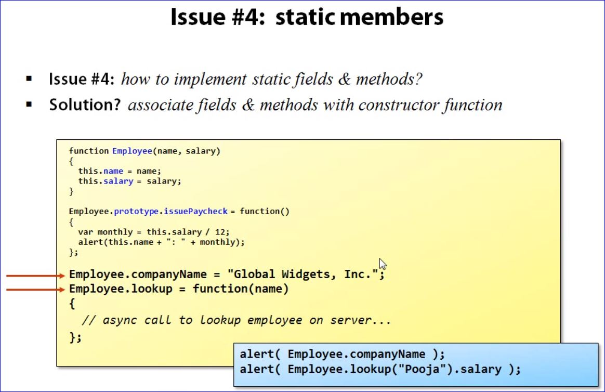
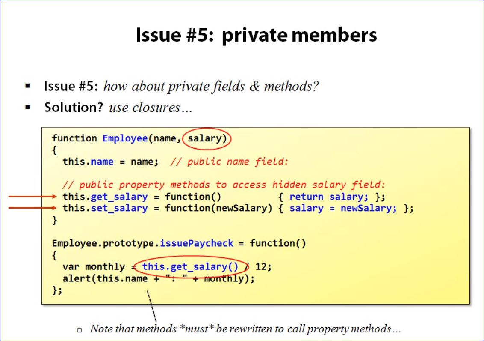

# AJAX JavaScript and JQuery

## Walking the DOM

The following page will walk the DOM and alert the different elements and associated values

```html
<html>
	<body id="theBody">
		<h1>My JavaScript test page</h1>
	</body>
</html>

<script>
	function walkTheDOM(node, F)
	{
		F(node);
		node = node.firstChild;
		while (node)
		{
			walkTheDOM(node, F);
			node = node.nextSibling;
		}
	}
	
	walkTheDOM(document.getElementById("theBody"),
				function (node) {alert(node.nodeName + "," + node.nodeValue); } );
</script>
```

## DOM Manipulation

**Example:** Creating and llinking new elements

```javascript
function onClick()
{
  var h3 = document.createElement("h3");
  var txt = document.createTextNode("Heading 3");

  h3.appendChild(txt);

  var body = document.getDelemntById("thebody");
  body.appendChild(h3);

  walkTheDOM( document.getElementById("thebody"), ...);
}
```

### Expanding the Walk the DOM page

```html
<html>
	<body id="theBody">
		<h1>My JavaScript test page</h1>
		<input type="text" id="txtInput" />
		<input type="button" value="Add text!" onclick="onAddText()" />
		<div id="container">
		</div>
	</body>
</html>

<script>
	function onAddText()
	{
		var cont = document.getElementById("container");
		var txt = document.getElementById("txtInput").value;
		cont.innerHTML += txt + "<br />";
	}
	
	function walkTheDOM(node, F)
	{
		F(node);
		node = node.firstChild;
		while (node)
		{
			walkTheDOM(node, F);
			node = node.nextSibling;
		}
	}
	
	walkTheDOM(document.getElementById("theBody"),
				function (node) {alert(node.nodeName + "," + node.nodeValue); } );
</script>
```

## Objects in JavaScript

- JavaScript does not contain the notion of a _class_
- So how do we define objects?

- Solution? In short:
  - _objects are collections of key/value pairs, where the keys represent the field & method names, and the values represent field values & method bodies..._
  - _**this** refers to current owner of executing method (**not like** C# - be careful!)_

```javascript
<script>
  var employee = new Object();

  employee["name"] = "Pooja"; //define Name key/value pair
  employee["salary"] = 72001.44; //define Salary key/value pair

  employee["issuePaycheck"] = function() { //define issuePaycheck pair
    var monthly = this["salary"] / 12;
    alert(this["name"] + ": " + monthly);
  }

  emp["issuePaycheck"]();
</script>
```

## Object Syntax











```javascript

<script>
function Employee(name, salary)
{
  this.name = name; //add Name key/value pair, with value name
  this.salary = salary; //add Salary key/value pair, with value salary
}

Employee.prototype.issuePaycheck = function() 
{ //add issuePaycheck key/value pair...
  var monthly = this["salary"] / 12;
  document.write(this.name + ": " + monthly);
};

var emp = new Employee("Fred", 100000);
emp.issuePaycheck();

</script>

```





