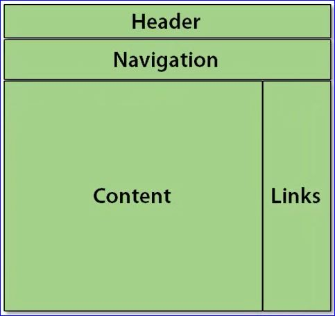

# CSS - Layout



## Position

- The default position is **static**. Static stacks block level elements (div, H1, p, etc...) top to bottom down the page.  This is the flow of the page.
- **relative** position moves an element away from where it should be in the document. Normally within the box created by it's parent element.
- **absolute** moves an element to a specific position relative to the body of a document
- **fixed** is similar to *absolute* however it is relative to the window itself

```css
#links
{
    /*move links 20px from the top and 50px from the left*/
    position:relative;
    top:20px;
    left:50px;
}
```

## Floating and Clearing

- **float** moves the specified element (and content) to the specified location and allows other elements (and content) to *float* along side it.
- **clear** puts the element back into the normal top down flow.

```css
/*float image 1  to  the left and give it a margin of 5px so text is not right up against the image on the right*/
#figure1
{
    float:left;
    margin-right:5px;
}

/*clear the float for an element with this class so it goes back into the normal flow and does not float against the element being floated*/
.clear
{
    clear:both;
}

```