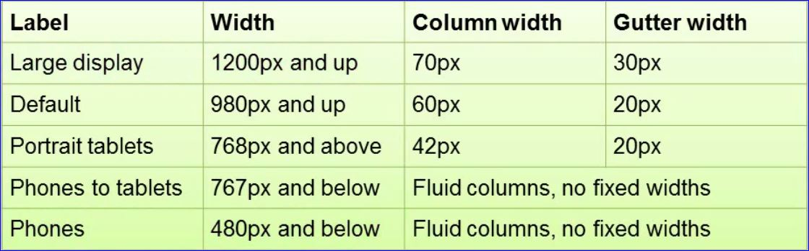

# Layout with Bootstrap

## Fixed Grid

- The outer most div has a class of row
    - Each row consists of 12 columns in the grid
- The next div has a class of span# to indicate how many columns the content should span
- The last div has a class of span# to indicate the remaining columns of 12 to span

- Adding a div with a class='container' centers the grid in the window
    - Columns are preserved in the 940px width of the grid
- The two grids we have looked at so far are known as _fixed grids_ because the column sizes don't respond to a change in the size of their container

## Fluid Grid

- changing class='row' to class='row-fluid' makes the columns in the row fluid or based on a percentage rather than a fixed size.  
- The container also needs to be changed to class='container-fluid' for the fluid behavior to occur.  
- A fluid row does not work in a fixed container. Now the grid will shrink or expand according to the size of the browser.

## Responsive Grid

- A responsive design reacts to the environment

### CSS Media Queries

```css
@media(min-width:768px) and (max-width:979px){
        /*-- styles for this size --*/
}
```

- Styles will only apply when the size of the screen falls in the range specified.
- bootstrap-responsive.css takes care of this for us.



