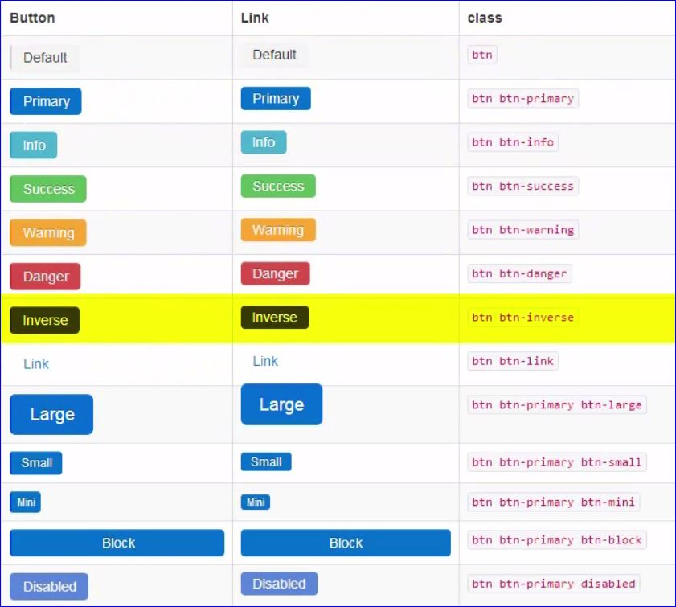

# Everyday Bootstrap

```css
class="small" /*reduces the size of the text*/
class="muted" /*gray*/
class="text-warning" /*yellow*/
class="text-error" /*red*/
class="text-info" /*blue*/
class="text-success" /*green*/

/*puts an underline on the CPU that shows the title when hovering*/
<abbr title="central processing unit">CPU</abbr>
<address></address>
<blockquote></blockquote>

class="unstyled" /*removes bullets and some padding*/
```

## Definition List

```html
<div>
    <dl class="horizontal">
        <dt>Bootstrap</dt>
            <dd>Some text</dd>
        <dt>CSS</dt>
            <dd>Some text</dd>
    </dl>
</div>
```

```css
class="btn-primary" /*makes button stand out a bit more*/
```

## Bootstrap Buttons



## Images and Icons

- **Font Awesome** includes many icons and font options
- Images have several classes such as img-rounded, img-circle and img-polaroid to make images appear with different styles
