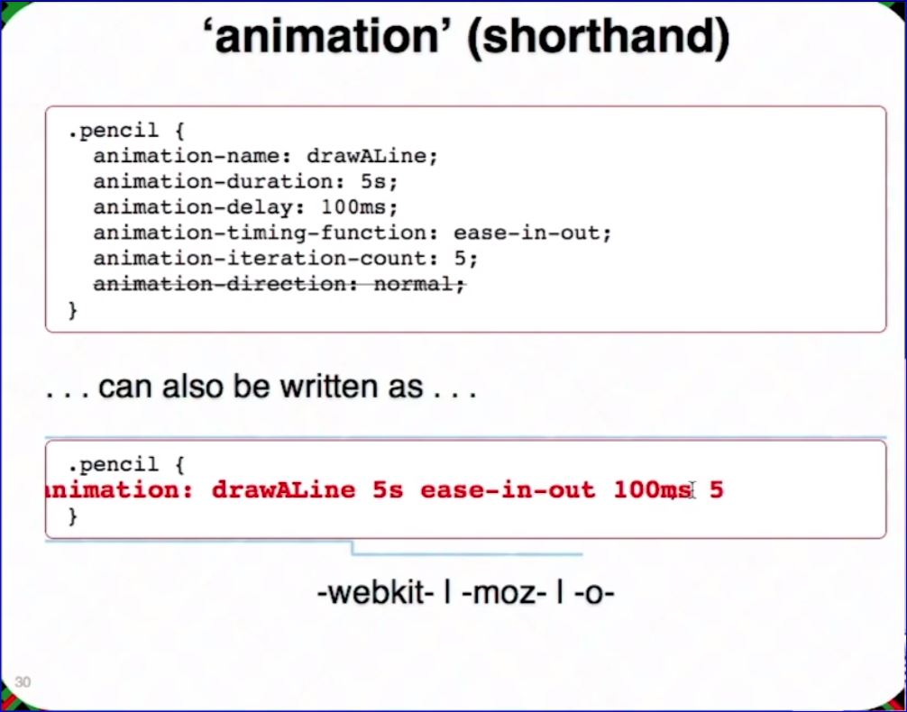

# CSS3 In-Depth

## Estelle Weyl

Estelle.github.com

- Estelle has several talks on different topics on her github page...check it out.

## Space:

```css
div#container p{
font-weight:bold;
}
```

It is the descendant selector. It will target all p tags within container div.

## > Sign:

It will target elements which are DIRECT children of a particular element.

```css
div#container > p {
  border: 1px solid black;
}
```

It will target all P element which are direct children of container div, not children of child div.

## + Sign:

It is Adjacent sibling combinator. It combines two sequences of simple selectors having the same parent and the second one must come IMMEDIATELY after the first.

```css
div + p {  
   color: green;  
} 
```

It will only select the first element that is immediately preceded by the former selector. 

## ~ Sign:

It is general sibling combinator and similar to Adjacent sibling combinator. the difference is that the second selector does NOT have to immediately follow the first one means It will select all elements that is preceded by the former selector.

```css
div ~ p{
background-color:blue;
} 
```

In regular expressions:

**The ^ means starts with**  
`E[attr^=val]`  
`a[href^=mailto] {background-image: url(emailicon.gif);}` This rule will place the emailicon.gif as the background image to any a tag with an href attribute starting with mailto

**The $ means ends with**  
 `E[attr$=val]`  
 `a[href$=pdf] {background-image: url(pdficon.gif);}` This rule will set a pdficon.gif as the background image on any a tag with an href attribute ending with pdf

**The * means matches all**  
 `E[attr*=val]` Element E whose attribute _attr_ matches val_ anywhere within the attribute.  Similar to `E[attr~=val]`, except the val can be a part of a word

 **NOTE**: Multiple attributes work! `a[title][href]`

 ## Pseudo-classes

 ### **Example 1**

```css
/* This rule finds an input of type check box and if it is checked turn the label IMMEDIATELY following red*/
input[type=checked]:checked + label {
    color: red;
}
```

### **Example 2**


### Interesting Lines of CSS
- This line of code flips the associated text 180 degrees  
`p {-webkit-transform: rotate(180deg);}`

## Generated Content

- `:before` and `:after` are two ways to generate content before and after contenct that is not selectable and not part of the DOM but can be styled in CSS

```css
element:before {
    content: ""; /* the content rule is the only part that is REQUIRED on the before and after psuedo selectors; however they can be empty */
}

element:after {
    content: "";
}
```


### Quotes


```css
.quote {
    border-radius: 10px;
    position: relative;
    padding: 20px;
    background-color: red;
    color: white;
}

/* This is the triangle portion of the quote window*/
.quote:after {
    position:absolute;
    content: '';
    width: 0; height:0;
    border: 20px solid transparent;
    border-top-color: red;
    bottom: -39px; left:20px;
}
```

### Thought Bubbles


* **Positioning is relative to the parent. So, if an element is positioned absolutely it is absolute, relative to the parent.  If no positioning is set on any ancestor; the positioning is relative to the body.**

#### Examples of Generated Content - Shapes

* [The Shapes of CSS](https://css-tricks.com/examples/ShapesOfCSS/): https://css-tricks.com/examples/ShapesOfCSS/

## Media Queries

[Media Queries](https://mediaqueri.es/): https://mediaqueri.es/

### Example 1

```css
/* If the content is being viewed on a screen style the content within a p element blue */
@media screen {
    p {
        color: blue;
    }
}

/* If the content is being printed style the content within the p element red */
@media print {
    p {
        color: red;
    }
}
```

### Example 2

#### Play with presentation window size

```css
body{
    -<prefix>-transition: all 1.5s linear;
}

/* background turns red when the screen size is taller than wide */
@media only screen and (orientation: portrait) {
    body{
        background: indianred;
    }
}

/* background turns yellow when the screen size width is less than 480px */
@media only screen and (max-width: 480px) {
    body {
        background: palegoldenrod;
    }
}
```

## Colors

- **HSLA** == Hue (red to red) Saturation Lightness Opacity.  This is good to use if you want real control over your colors and mixtures

- **transparent** == transparent black `rgba(0, 0, 0, 0);`
- **CurrentColor** == current Text color
- **_Accessibility:_** Color is **NOT** the only visual means of conveying information, indiacating an action, prompting a response, or distinguishing a visual element.
- **appearance**: Changes the appearance of buttons and other controls to resemble native controls

## AlphaTransparency Tips

### Used in RGBA and HSLA colors

```css
rgba(58, 103, 171, 0.5);
hala(216, 49%, 45%, 0.5);
```

### Transparent Shadows

```css
.trans {
    box-shadow: -10px 10px rgba(0,0,0,0.3);
    text-shadow: 0 21px 1px rgba(0,0,0,0.3);
    }
```

### Solid Shadows

```css
.solid {
    box-shadow: -10px 10px #999;
    text-shadow: 0 21px 1px #999;
    }
```

**Opacity** is the condition of lacking transparency or translucence.  For example, thinner paints need black added to increase opacity.  In CSS, the **_opacity_** value is from 0.0 - 1.  The lower the value, the more transparent.

## Fonts, Shadows, and Text Effects

```css
text-shadow: left top blur color;

/*nice*/
.trans {
    text-shadow: 0 5px 1px rgba (0,0,0,0.2);
}

/*upgly*/
.solid {
    text-shadow: 0 5px 1px #999;
}
```

## Transforms

CSS transforms allow you to translate, rotate, scale and skew elements.  A transformation is an effect that lets an element change shape, size and position.

**translate**: moves the object left 80px and up 200px

```css 
transform: translate(-80px, 200px);
```

**rotate**: rotates the object 15 degrees to the right along both x and y planes

```css
transform: rotate(15deg);
```

**scale**: scales the object 1.5 times along the x plane and 2 times along the y plane

```css
transform: scale(1.5, 2);
```

**skew**: skews along the x plane leaving making the y plane appear unparallel while the x plane continues to be parallel

```css
transform: skewX(-8deg);
```

### Multiple Transforms

If multiple transforms are needed they must be combined; otherwise, one will overwrite the previous

```css
transform: translate(-80px, 200px) rotate(15deg) scale(2, 1.5) skewX(8deg);
```

#### Example:

```css
.box {
    -webkit-transform:
        rotate (0)
        translate(0,0)
        skew(0,0)
        scale(1);
}
/* Change the above values to see where the box ends up */
```


By default everything rotates around the mid-point as the origin, but that's boring so we can use the `transform-origin` property to choose where the transformation origion point is.

Specifies the x and y position of the origin, relative to the transform object:

* Keyword positions: left, right, bottom, top, center
* Length values
* Percentage values
* default is 50% 50% (or center center)
* Supported in all browswers that support transform. Prefixed if transform is prefixed.

```css
.box {
    -webkit-transform:
        rotate (230deg)
        translate(0,0)
        skew(0,0)
        scale(1);
    -webkit-transform-origin: bottom right;
    background-color: goldenrod;
}
/* Change the above values to see where the box ends up */
```


## Transitions & Animations

Enables the transition of properties from one state to the next over a defined length of time

* **transition-property**: properties (or 'all') that transition
* **transition-duration**: s or ms it takes to transition
* **transition-timing-function**: bezier curve of transition
* **transition-delay**: s or ms before transition starts
* **transition**: shorthand for 4 transition properties


### Transition Drop Down Menus


### Keyframes


### 'animation-timing-function'


### 'animation' (shorthand)

