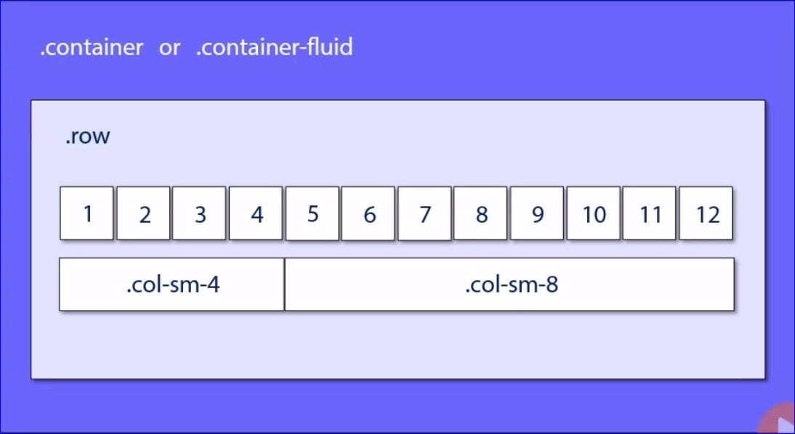
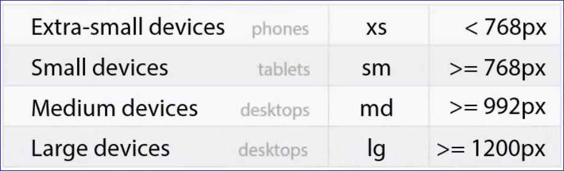

# Responsive Patterns Using Bootstrap

http://www.lukew.com

* [Multi-Device Layout Patterns](https://www.lukew.com/ff/entry.asp?1514)

## Bootstrap Grid Classes

* Everything is contained in a container.
  * **.container** everything is centered in the viewport especially on larger displays
  * **.container-fluid** will always take up the entire width of the viewport.

* Inside the container element comes the class of **.row**. Inside the _.row_ class is where we have the 12 column grid.

* Anything in the size indicated and larger will use the specified breakpoints.  Anything smaller the specified column size will not take effect and the content will take up the entire viewport.

* Specifying multiple column sizes will change the view at the different breakpoints ex: `.col-sm-4 .col-lg-2`

## Mostly Fluid

## Column Drop

## Layout Shifter

## Content Reflow