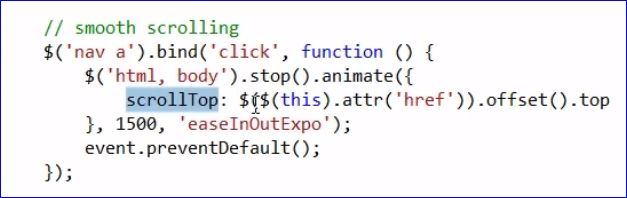

# Responsive Websites with Bootstrap 3

Mark Zamoyta
www.curiousinvention.com
mark@curiousinventions.com

**Responsive** a single website that responds to the size of the users viewport

**github.com/Formstone/Wallpaper** to add Video Wallpaper to our page

**fortawesome.github.io/font-awesome/icons** for special / cool icons like the scroll down arrow

## Smooth Scrolling

* In Google search for jQuery easing plugin
* Look for gsgd plugin
* Used jQuery Easing Plugin: http://gsgd.co.uk/sandbox/jquery/easing
* jQuery's animate() function, setting scrollTop property

## Parallax Scrolling

* When the background appears to scroll slowers than the foreground
* Stellar.js
* http://markdalgleish.com/projects/stellar.js

## Animation

* Bootstrap's carousel component
* An image gallery: **nanoGallery**
* http://mynameismathieu.com/WOW for **WOW.js** coupled with **Animate.css** http://daneden.github.io/animate.css

### **Bear Grylls website is one of the coolest I've ever seen.**