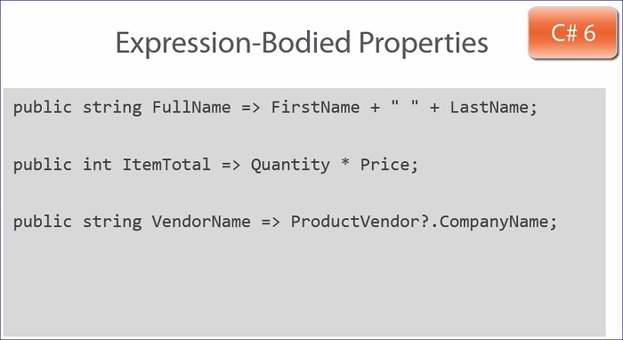

#Coding Properties
##Common type of code in the <i>getter</i> include:
- Check the user's credentials
- Check the application state
- Format the returned value
- Logging
- Lazy loading

##Common type of code in the <i>setter</i> include:
- Check the user's credentials
- Check the application state
- Validate the incoming value
- Logging or change tracking
- Format, convert, clean up

##Property Best Practices
###<font color="green">DO</font>:
- Define a meaningful name
- Use PascalCasing
- Add code in the getter to protect, format, initialize, ...
- Add code in the setter to protect, format, validate, ...

###<font color="red">AVOID:</font>
- Single character name
- Abbreviated names

#Auto-implemented Properties
- Provide a more Concise property declaration
- Implicit backing field
- Don't allow for any code in the getter or setter
- Best used for simple properties that don't require any additional logic or processing
##Initializing Auto-Implemented Properties
- Can be initialized as of C# 6
 - `public string Category { get; set; } = "Tools";` This sets the default Category to Tools
 - `public Vendor productVendor { get; set; } = GetDefaultVendor();` Indicates the default vendor does not have to be hard coded
- Can only call Static Methods; the <b>GetDefaultVendor</b> method must be static
- To initialize without a static method; must use the constructor
  ```csharp
  public Vendor productVendor { get; set; }
  public Product()
  {
    this.ProductVendor = GetVendor();
  }
  ```
##Read-Only Auto-Implemented Properties
- Sometimes referred to as immutable properties because they can't be changed
- Have a getter but no setter
 - `public int InventoryCount { get; }`
- Can be initialized in the constructor
  ```csharp
  public Product()
  {
    this.InventoryCount = GetInventoryCount();
  }
  ```

##Auto-Property Best Practices
###<font color="green">DO</font>:
- Define a meaningful name
- Use PascalCasing
- Initialize on the declaration when needed


###<font color="red">AVOID:</font> 
- Single character name
- Abbreviated names
- If property requires code in the getter or setter

#Property Accessibility
- Use <b>public</b> to grant access to the property from any code
- Use <b>protected</b> most often when working with inheritance in a base class
- Use <b>internal</b> to limit access to the component in which the property is defined
- <b>protected internal</b> limits access to the same component and inherited classes
- <b>private</b> limits access to only the class in which the property is declared

<i>getters</i> and <i>setters</i> can have accessibility modifiers in addition to properties; however, the can't both have one in the same property declaration
When setting accessibility on getters or setters make the property accessibility the least restrictive and getter or setter more restrictive
The accessibility of the getter or setter can not be less restrictive than the property accessibility

#Additional Uses of Properties
- Define concatenated values

```csharp
public string LastName { get; set; }
public string FirstName { get; set; } 
        
public string FullName
{
    get { return FirstName + " " + LastName; }
}
```

- Express calculation

```csharp
public int Quantity {get; set;}
public int Price {get; set;}

public int LineItemTotal
{
    get { return Quantity * Price; }
}
```
  
- Expose related object properties
```csharp
public Vendor ProductVendor { get; set; }

public string VendorName
{
    get { return ProductVendor?.CompanyName; }
}
```

#Expression-bodied Properties
##Syntax Shortcut
For Read-only properties that immediately return a value.  
Expression-bodied properties are great for properties that define concatenated values, express calculations or expose related object properties.

###Long
```csharp
public string FullName
{
    get { return FirstName + " " + LastName; }
}
```

###Shortcut (expression-bodied)
* No *curly braces*
* No *get* keyword
* No *return* statement
* Just a => ... this is technically called a <b>Lambda Operator</b>; some people call it *fat arrow* syntax



#Benefits of Properties
* Fine grained access control
* Execute code before return or setting a value
* Set break points or logging
* Available for data binding