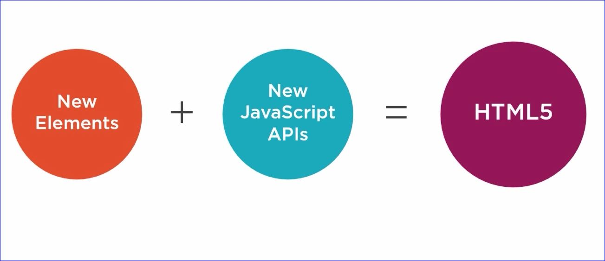
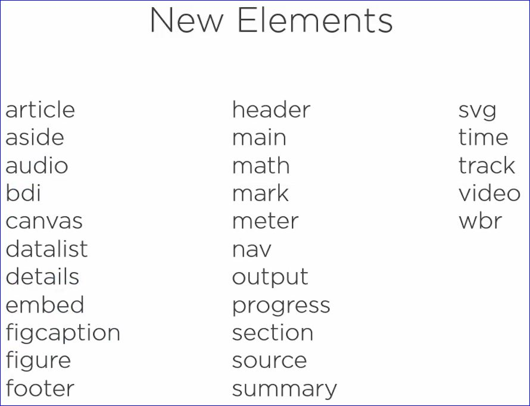

# Introduction

<p class="quote">"HTML4 is a markup language used for structuring and presenting content on the WorldWide Web. -- Wikipedia"</p>

HTML 5 uses containers or elements with specific intent...this makes it easier for search engines.

For example:

```html
<html>
    <body>
        <header>...</header>
        <main>...</main>
        <footer>...</footer>
    </body>
</html>
```

versus the old format of HTML

```html
<html>
    <body>
        <div id="header">...</div>
        <div id="main">...</div>
        <div id="footer">...</div>
    </body>
</html>
```



## Elements with APIs

### Meter

```html
<meter
    value="70"
    min="0"
    max="100">
    70 out of 100
</meter>
```

#### Meter Example

<meter
    value="70"
    min="0"
    max="100">
    70 out of 100
</meter>

### Progress

```html
<progress 
    max="100"
    value="50">
</progress>
```

#### Progress Example

<progress 
    max="100"
    value="50">
</progress>

## New Elements in HTML5



## New Javascript APIs

[HTML5 & Javascript Information](https://platform.html5.org)

div and section elements are essentially the same

Use `<div>` when you want to change the appearance of something on the page

Use `<section>` for logical group between elements

[HTML5 Boiler Plate](https://html5boilerplate.com)

### Features

To find out if an HTML5 feature can be used in a specific version of a web browser visit [caniuse.com](http://caniuse.com).

#### Feature Detection

It is preferrable to use feature detection over browser detection.  [Modernizr](https:modernizr.com) is a small piece of JavaScript code thaqt automatically detects the availability ofnext-generation web technologies in your user's browsers.