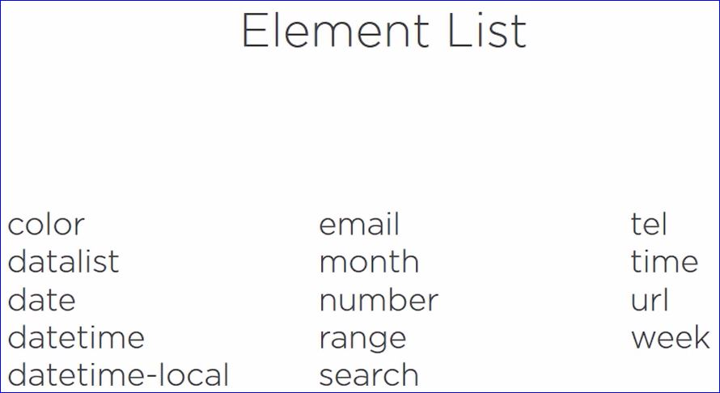

# Working with User Input

## New Elements Overview



### Examples

```html
<input type="color" />
```

<input type="color" />

```html
<input list="colors"/>
<datalist id="colors">
    <option value="Blue">
    <option value="Red">
    <option value="Yellow">
    <option value="Orange">
    <option value="White">
</datalist>
```

<input list="colors"/>
<datalist id="colors">
    <option value="Blue">
    <option value="Red">
    <option value="Yellow">
    <option value="Orange">
    <option value="White">
</datalist>

```html
<input type="datetime" placeholder="Datetime" />
<input type="datetime-local" placeholder="datetime-local" />
```

datetime
<input type="datetime" placeholder="Datetime" />

datetime-local
<input type="datetime-local" placeholder="datetime-local" />

```html
<input type="email" />
<input type="url" />
<input type="tel" />
```

on a desktop these render like any input box; however, on a mobile device this brings up an optimized keyboard, if supported

Email <input type="email" /> 

URL <input type="url" />

Tel <input type="tel" />

```html
<input type = "month" />
<input type = "number" />
<input type = "range" />
<input type = "week" />
<input type = "time" />
<input type = "search" />
```

Month <input type = "month" />

Number <input type = "number" />

Range <input type = "range" />

Week <input type = "week" />

Time <input type = "time" />

Search <input type = "search" />

**Never trust** (user) **input** always validate

## Validation Rules

<p class="tip">Always replicate validation on the server!</p>

**Value Missing** _true_ if an element marked as _required_ has an empty value

```html
<input type="text" required value="" />
```

**Type Mismatch** _true_ when the value is not matched to the declared type

```html
<input type="url" value="hi" />
```

**Pattern Mismatch** _true_ when an element's value doesn't match given the regular expression

```html
<input type="text" pattern="/^[A-z]+$/" value="1234" />
```

**Too Long** true when an element's value length is longer than the value in the maxlength attribue

```html
<input type="text" maxlength="3" value="hello" />
```

The **novalidate** attribute turns off validation; this is useful for a search box.

```html
<form novalidate class="narrow" >
```

