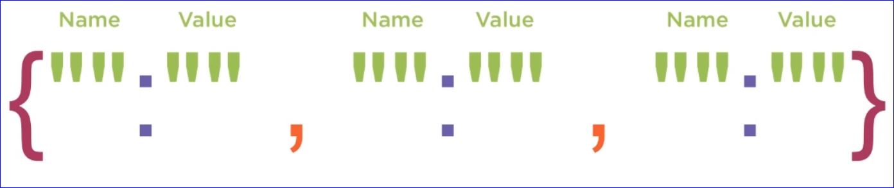
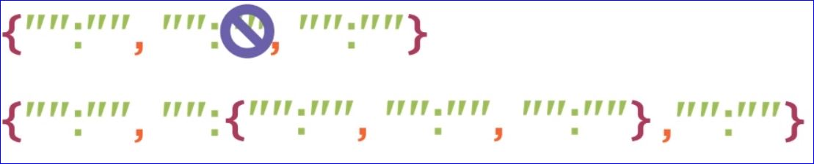
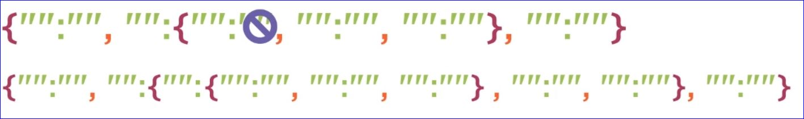
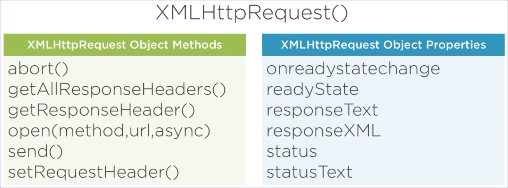
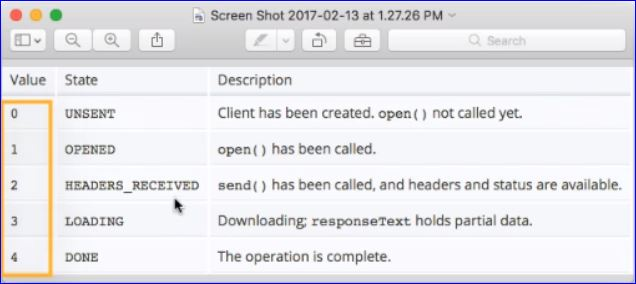

# Hands-on JavaScript Project using JSON

**JSON**: **J**ava **S**cript **O**bject **N**otation

- Used to exchange data between a browser and server
- Can be converted from _string_ to _object_ and from _object_ back to a _string_
  - Data transferred to and from a server should be a string
- JSON data is formated using name value pairs




- Data comes from the server as a _**string**_
- We use **parse()** to convert it to JSON
- When sending data to a URL we must convert the data to a string using **stringify()**
- There is no limit to how many name : value pair levels can be used

#### Single Level Deep Example


#### 2 Level Deep Example



#### 3 Level Deep Example



#### JavaScript Example

```javascript
// JavaScript Document

// Create a name;value pair
var start = '{"favColor":"Orange", "favSeason":"Fall"}';

// Convert it to a JSON Object
var myObject = JSON.parse(start);
console.log(myObject);

// Convert the JSON Object back to a string
var myString = JSON.stringify(myObject);
console.log(myString);

// Convert it to a JSON Object
var myObject = JSON.parse(myString);
console.log(myObject);


// Single Level JSON
var theData1 = '{"first":"Cody", "last":"Jones", "city":"Wellsville"}';
var myObj = JSON.parse(theData1);
console.log(myObj);

document.getElementById('message').innerHTML = myObj.last + ", " + 
    myObj.first + ": " + 
    myObj.city;

// Double Level JSON
var theData2 = '{"Jane":{"age":"29", "degree":"MFA"}, "Jim":{"age":"49", "degree":"MA"}}'
var myObj2 = JSON.parse(theData2);
console.log(myObj2);

document.getElementById('message').innerHTML = myObj2.Jane.age;


// Triple Level JSON
var theData3 = '{"Jane":{"age":"29", "degree":{"BA":"UVA", "MA":"VMI"}}, "Jim":{"age":"49", "degree":"MA"}}'
var myObj3 = JSON.parse(theData3);
console.log(myObj3);

document.getElementById('message').innerHTML = myObj3.Jane.degree.BA;
```

**AJAX** stands for Asynchromous JavaScript And XML





```javascript
// Create a new XMLHttpRequest Object
var xhr = new XMLHttpRequest();

// prepare the object
xhr.open('GET', 'data.json', 'true');

xhr.send();

xhr.onreadystatechange = function() {
    console.log(xhr.readyState);
    console.log(xhr.status);
    console.log(xhr.statusText);
}
```