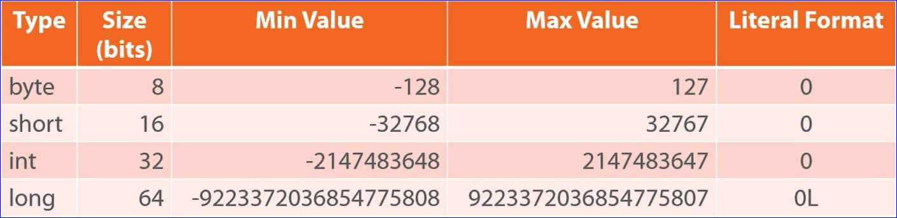
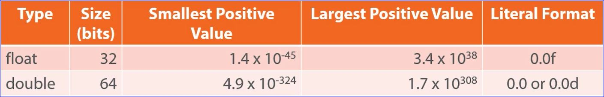
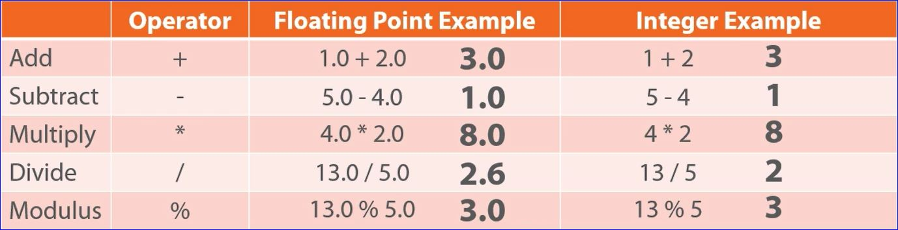
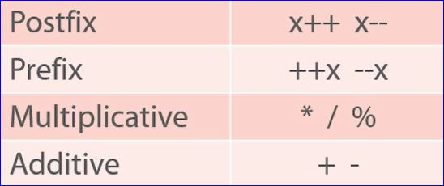
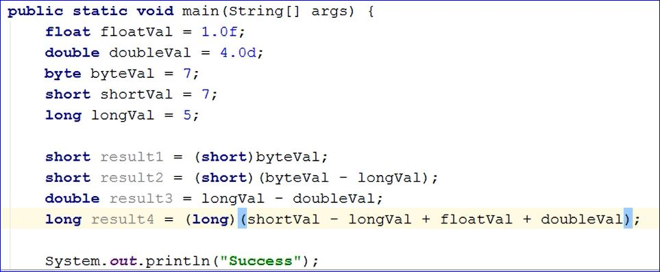

# Variables, Data Types and Math Operators

## Variables
* Named data storage
* Strongly typed: this means you must specify the type of data being stored in the variable and only data of the specified type may be stored in the variable
```java
int dataValue; //declare the variable and type
dataValue = 100; //assign a value to the variable

//or

int dataValue = 100; //declare, name and assign a value in one statement

```
* Value can be modified: The program may modify the value of the data stored in the variable
* Variables can be declared anywhere in the program; they do not have to all be at the top
### Naming Variables
* Variable naming is based on a combination of rules and conventions
    * Rules allow the use of letters, number, $ and _
        * By convention only letters and numbers are used
    * Rules require that first character is not a number
        * By convention it is always a letter
    * By convention follow the style often referred to as "Camel Case"
        * First letter is lower case
        * Start of each word after the first is upper case
        * All other letters are lower case

## Primitive Data Types
* Built into the language
* Foundation of all other types
* Four categories of primitive types
    * Integer
    * Floating point
    * Character
    * Boolean

### Integer Types


* When you use a long type you must put an **L** at the end of the assigned value

### Floating Point Types
* Implementation of IEEE 754 floating point standard
* Stores values containing a fractional portion
* Supports positive, negative and zero values
* For mor information see [Floating Point Info](http://bit.ly/psjavafp )

* Must put an **f** at the end of an assignment of a *float* type 
* Must put a **d** at the end of an assignment of a *double* type

### Character and Boolean Types
* The **char** type stores a single Unicode character
    * Literal values placed between single quotes
    * For Unicode code points, use \u followed by 4-digit hex value
* The **boolean** type stores true/false values
    *Literal values are true and false

### Primitive Types are Stored By-value
This means each variable has it's own separate copy of the data.

## Arithmetic Operators
* Basic Operators = Normal add, subtract, divide multiply (/ * - +)
* Modulus is the remainder and denoted by %

* Prefix/postfix operators such as ++ and --
    * ++ increments value by 1
    * -- decrements value by 1
```java
    //Prefix
    int myVal = 5;
    System.out.println(++myVal);    //prints 6
    System.out.println(myVal);  //prints 6

    //conversely Postfix
    int myVal = 5;
    System.out.println(myVal++);    //prints 5
    System.out.println(myVal);  //prints 6
```

* Compound assignment operators such as +=, -=, /=, *= and %=
    * Combine an operation and assignment
    * Applies result of right side to left side
    * Stores that result in the variable on the left side
```java
int myVal = 50;
myVal -= 5;
System.out.println(myVal); //prints 45

// Another example

int result = 100;
int val1 = 5;
int val2 = 10;
result /= val1 * val2;
// 5*10 = 50
//100 / 50 = 2
System.out.println(result); //prints 2
```

### Operator Precedence
* Operators are evaluated in a well-defined ordere
* Operators of equal precedence are evaluated left to right
* Can override precedence with parenthesis
    * Nested parenthesis evaluated from the inside out  



## Type Conversion
### Implicit
* Conversion performed automatically by the compiler
* Widening conversion are automatic
* Mixed integer sizes
    * Uses largest integer in equation
* Mixed floating point sized
    * Uses double
* Mixed integer and floating point
    * Uses largest floating point in equation
```java
int iVal = 50;
long lVal = iVal; 
//the compiler has to convert the int val to a long val before storing the value
```
### Explicit
* Conversions performed explicitly in code with cast operator
* Can perform widening and narrow conversion
    * 32bit to 64bit (widening)
    * 64bit to 32bit (narrowing)
* Floating point to integer drops fraction
* Use caution with narrowing conversions; make sure the 64bit value is not too large to fit in a 32bit variable
* Integer to floating point can lose precision
* More information on data conversion: [Data Conversion](http://bit.ly/pstypeconversion)

```java
long lVal = 50;
int iVal = (int) lVal; //take the lVal and cast it down to a 32bit integer
```

## Casting Example

