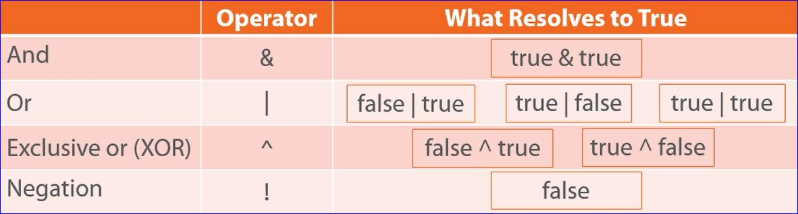
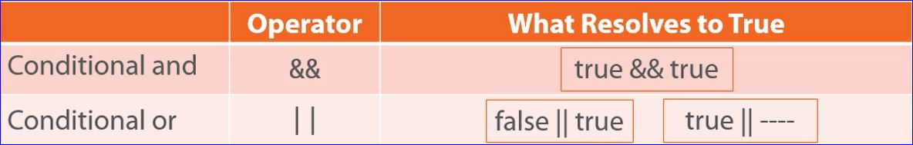
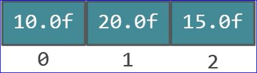

# Conditional Logic, Looping and Arrays

## Conditional Assignment
<em>result = <span class='blue'>condition</span> ? <span class='green'>true-value</span> : <span class='red'>false-value</span></em>;
###### Example
```java
int v1 = 7;
int v2 = 5;

int vMax = v1 > v2 ? v1 : v2;
System.out.println(vMax); //vMax = 7
//is v1 greater than v2?
//if yes vMax gets v1 assigned
//if no vMax gets v2 assigned
```

## If-else Statement
* Any if statement conditionally executes a statement
* The optional else clause executes a statement when the if condition is false
```
if (condition)
    true-statement;
```
###### Example
```java
int v1 = 10;
int v2 = 4;

if (v1 > v2)
    System.out.println("v1 is bigger");
else
    System.out.println("v1 is not bigger");
```
### Chaining if-else statements
* If-else statements chained together are evaluated in order until one is true
```
if (condition-1)
    true-statement-1;
else if (condition-2);
    true-statement-2;
    .
    .
    .
else if (condition-N)
    true-statemtn-N;
else
    false-statement;
```
## Block Statements
* A block statement groups statement into a compound statement
```
{
    statement-1;
statement-2;
.
.
.
statement-N;
}
```
###### Example
```java
int v1=10, v2=4, diff;  //one line to declare all int variables
if(v1 > v2) {
    diff = v1-v2;
    System.out.println("v1 is bigger");
    System.out.println(diff);
}
else if (v2 > v1) {
    diff=v2-v1;
    System.out.println("v2 is bigger");
    System.out.println(diff);
}
else
    System.out.println("v1 and v2 are equal");
```
## Block Statements and Variable Scope
* A variable declared within a block is not visible outside of the block
    * A variable's range of visibility is known as the variable's <em>scope</em>
## Logical Operators

## Conditional Logical Operators

* Resolve following conceptually similar rules as non-conditional and/or
* Only execute the right side if needed to determine the result
    * && only executes right-side if left-side is true
    * || only executes right-side if left-side is false
###### Example
```java
int students = 150, rooms=0;

if(rooms > 0 & students/rooms > 30) //error because it still evaluates the right side even if rooms is 0

if(rooms > 0 && students/rooms > 30) //only runs the second condition if the first is true
```
## Looping
### While loop
* Repeatedly executies a statement as long as the condition is true
    * Condition is checked at the loop start
    * Statement may never execute
```
while (condition){
    statement;
}
```
###### Example
```java
int kVal=5, factorial=1;
while(kVal > 1){
    factorial *= kVal;
    kVal -= 1;
}
System.out.println(factorial);

// An equivalent while loop is:
while (kVal > 1)
    factorial *= kVal--; //the -- is the decrement operator
```
### Do-while loop
* Repeatedly executes a statement as long as the condition is true
    * Condition checked at loop <em>end</em>
    * Statement <strong>always</strong> executes at least once
```
do
    statement;
while(condition);
```
###### Example
```java
int iVal = 5;
do {
    System.out.print(iVal); //"print" stays on same line whereas "println" prints then goes to a new line
    System.out.print(" * 2 = ";)
    iVal *= 2;
    System.out.println(iVal);
} while(iVal < 100);
```
### For loop
* Repeatedly executes a statement as long as the condition is true
    * Condition is checked at the loop start
    * A for loop is more a convenience loop for a while loop
    * Provides simplified notation for loop control values
```
for(initialize; condition; update)
    statement;
```
###### Example
```java
for(int iVal = 1; iVal < 100; iVal *= 2){
    System.out.println(iVal);
}
```
## Arrays
* Provides an ordered collection of elements
    - Each element accessed via an index
    - Indexes range from 0 to number-of-elements minus 1
    - Number of elements can be found via array's length value
```java
//declare / define the array
/* float[] theVals = new float[3];
theVals[0] = 10.0f;
theVals[1] = 20.0f;
theVals[2] = 15.0f;*/

// a preferred and easier way to declare an array is:
float[] theVals = { 10.0f, 20.0f, 15.0f };

float sum = 0.0f;
for(int i = 0; i < theVals.length; i++)
    sum += theVals[i];

System.out.println(sum);
```
##### theVals


## For-each Loop
* Executes a statement once for each member in an array
    - Handles getting collection length
    - Handles accessing each value

```java
for(loop-variable-declaration:array)
    statement;
```
###### Example
```java
float[] theVals = { 10.0f, 20.0f, 15.0f };
float sum = 0.0f;
for(float currentVal:theVals){
    sum += currentVal;
}
System.out.println(sum);
```
## Swtich
* Transfers control to a statement based on a value
    - Simplifies testing against multiple possible matches
    - Only primitive type supported are <em>char</em> and <em>int</em>
    - A match can execute more than one statement
    - Use the <strong>break</strong> key work to avoid <em>"falling through"</em>
    - Can optionally include <strong>default</strong> to handle any unmatched values
```java
swtich(test-value){
    case value-1:
        statements
    case value-2:
        statements
    .
    .
    .
    case value-n:
        statements
    default:
        statements
}
```
###### Example
```java
int iVal = 10;

switch(iVal % 2){ //modulus is the remainter so iVal / 2 will be 0 if the value is even and 1 if the value is odd
    case 0:
        System.out.println(iVal);
        System.out.println(" is even");
        break;
    case 1:
        System.out.println(iVal);
        System.out.println(" is odd");
        break;
    case default:
        System.out.println("oops it brok");
        break;
}
```