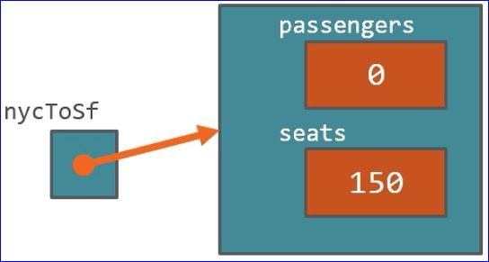
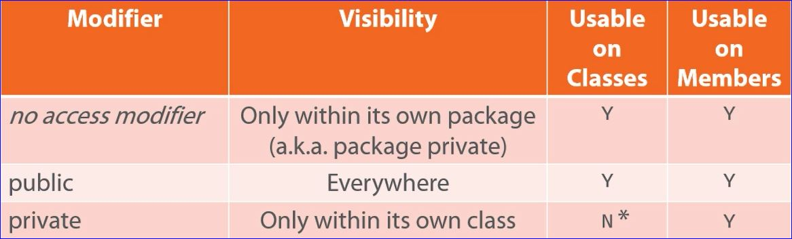

# Representing Complex Types with Classes

## Classes in Java

* Java is an object-oriented language
* Objects encapsulates data, operations, and usage semantics
  * Allows storage and manipulation details to be hidden
  * Separates "what" is to be done from "how" it is done
* Classes provide a structure for describing and creating objects
* A class is a template for creating an object
  * Declared with the class keyword followed by the class name
  * Java source file name normally has same name as the class
* A class is made up of both state and executable code
  * Fields
    * Store object state
  * Methods
    * Executable code that manipulates state and performs operations
  * Constructors
    * Executable code used during object creation to set the intial state

*_Example Flight.java_*

```java
class Flight {
    //fields
    int passengers;
    int seats;

    //Constructor
    Flight(){
        seats = 150;
        passengers = 0;
    }

    //method
    void add1Passenger(){
        if(passenters < seats)
            passenters += 1;
    }
}
```

## Using Classes

* Use the new keyword to create a class instance (a.k.a. an object)
  * Allocates the memory described by the class
  * Returns a reference to the allocated memory



```java
//declaring a class in separate statements
Flight nycToSf;
nycToSf = new Flight();

//declaring a class in a single statement
Flight slcToDallas = new Flight();

slcToDallas.add1Passenger(); //will increase the number of passengers from 0 to one on the slcToDallas Flight object instance
```

## Classes are Reference Types

```java
Flight flight1 = new Flight();
Flight flight2 = new Flight();
flight2.add1Passenger();
System.out.println(flight2.passengers); //prints 1

flight2 = flight1; //points flight2 to the same instance/reference of the flight class that flight1 is pointing at
System.out.println(flight2.passengers); //prints 0 now since that reference to the flight class has not had any passengers added.  The old reference is now gone.

flight1.addPassenter();
flight1.addPassenter();
System.out.println(flight2.passengers); //prints 2 since flight1 and flight2 both point to the same reference of the flight class
```

## Encapsulation and Access Modifiers

* The internal representation of an object is generally hidden; this concept is known as _encapsulation_
* Java uses _access modifiers_ to achieve encapsulation 

### Basic Access Modifiers



* As private applies to top-level classes; private is available to nested-classes
* If a class is marked as public the name of the class file and the containing class **must** be named the same

###### Example

```java
public class Flight { //public access modifier says we can access this class from anywhere
    //fields
    private int passengers; //private says these fields are accessable inside the class
    private int seats;

    //Constructor
    public Flight(){ //public on the constructor means I can now create instances of this class anywhere
        seats = 150;
        passengers = 0;
    }

    //methods
    public void add1Passenger(){
        if(passenters < seats)
            passenters += 1;
        else
            handleTooMany();
        }

    private void handleTooMany(){
        System.out.println("Too many");
    }
}
```

### Naming Classes

* Class names follow the same rules as variable names
* Class name conventions are similar to variables with some differences
  * Use only letters and numbers
  * First character is always a letter
  * Follow the style often refereed to as "Pascal Case"
    * Start of each word, including the first, is upper case
    * all other letters are lower case
  * Use simple, descriptive nouns
  * Avoid abbreviations unless abbreviation's use is more common than full name (for example URL is much more common than UniformResourceLocator)

## Method Basics

* All methods are inside of classes
* Executable code that manipulates the state of our objects and performs operations
  * Name
    * Same rules and conventions as variables
    * Should be a verb or action
  * Return type
    * Use void when no value returned
  * Type parameter list
    * Can be empty
  * Body contained with brackets
> <em><span class='darkorange'>return-type</span> <span class='purple'>name</span> ( <span class='teal'>typed-parameter-list</span> ) {  
<span class='green'>statements</span>  
}</em>

###### Example

```java
public class MyClass{
    public void showSum (float x, float y, int count){
        if (count < 1)
            return; //return to the method caller if count is less than 1
        float sum = x + y;
        for (int i = 0; i < count; i++)
            System.out.println(sum);
    }
}

MyClass m = new MyClass(); //create an instance of our object
m.showSum(7.5, 1.4, 3); //call the method showSum that is part of the object instance m and pass the necessary parameters.
```

### Exiting from a Method

* A method exits for one of three reasons
  1. The end of the method is reached
  1. A return statement is encountered
  1. An error occurs.
* Unless there's an error, control returns to the method caller

### Method Return Values

* A method returns a singel value
  * A primitive value
  * A reference to an object
  * A reference to an array
    * Arrays are objects in Java

### Special References: this and null

* Java provides special references with predefined meanings
  * *this* is an implicit reference to the current object
    * Useful for reducing ambiguity
    * Allows an object to pass itself as a parameter
* *null* is a reference literal
  * Reprsents an uncreated object
  * Can be assigned to any reference variable

## Field Encapsulation

In most cases, a class' fields shold not be directly accessible outside of the class

* Helps to hide the implementation details
* Use methods to control access to those fields

### Accessors and Mutators

* Use the accessor/mutator patern to control field access
  * **Accessor** rtetrieves field value
    * Accessor is also called _getter_
    * Method name: get<em>FieldName</em>
  * **Mutator** modifies field value
    * Also called _setter_
    * Method name: set<em>FieldName</em>
    * Mutators do not return a value

```java
public class Flight
    private int passengers;
    private int seats;

    public int getSeats(){
        return seats;

    public void setSeats (int seats){
        this.seats = seats; //this references the field seats
    }
}
```