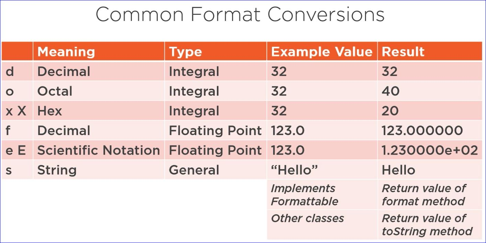
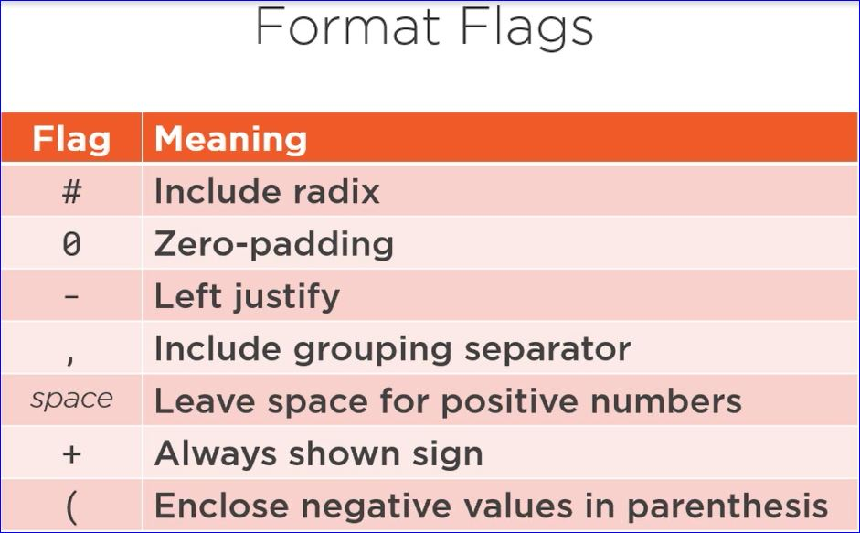
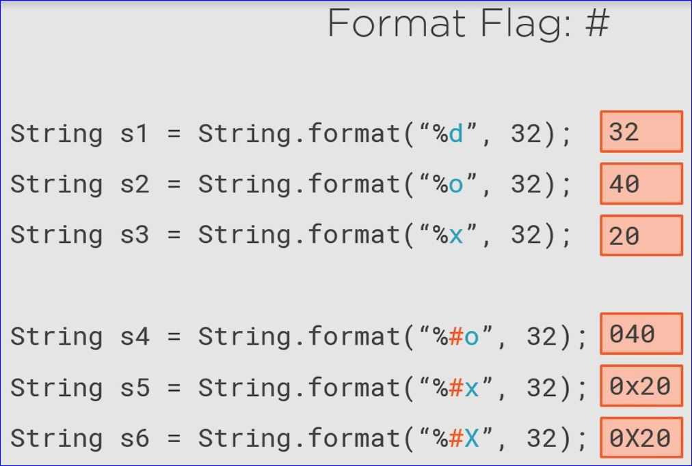
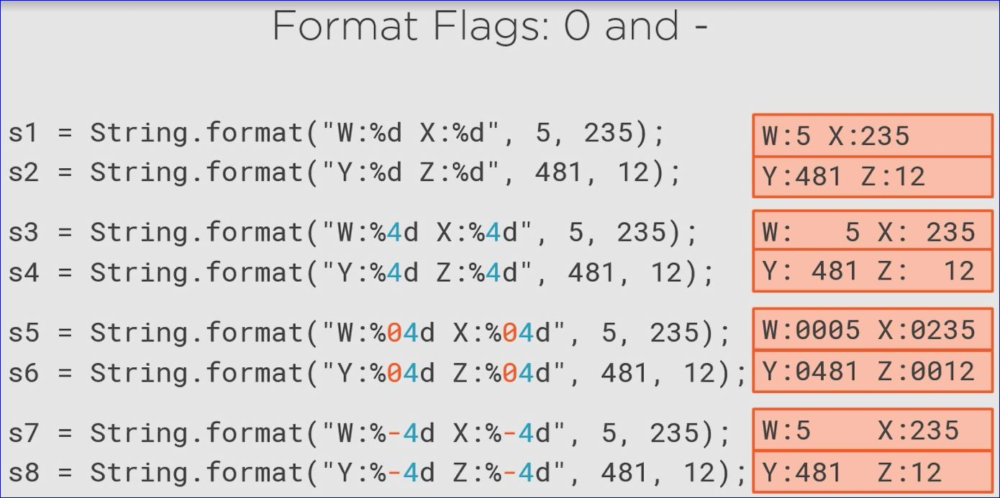
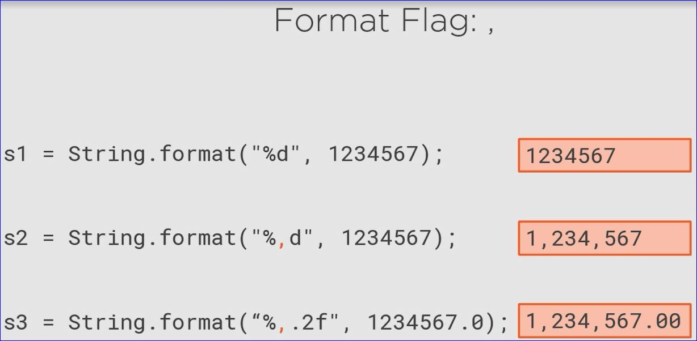
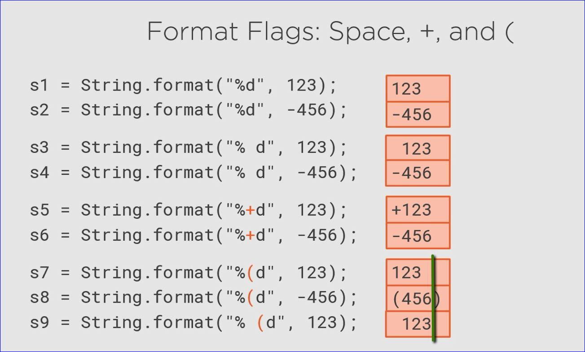
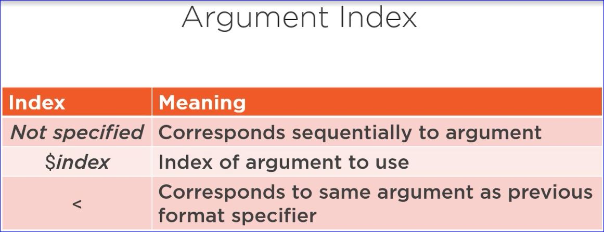
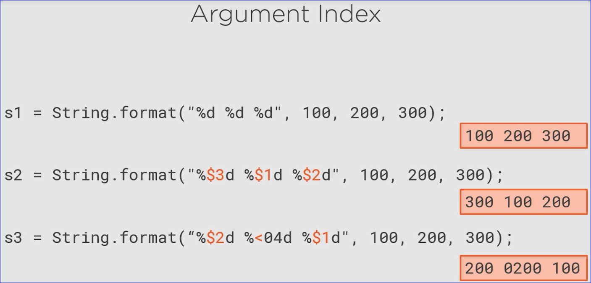

# Module 3: String Formatting and Regular Expressions

## StringJoiner

```java
StringJoiner sj = new StringJoiner(", ", "{", "}");
//The first parameter indicates how you want to seperate each value being joined
//The second to parameters indicate the starting and closing values

sj.add("alpha").add("beta").add("gamma");
String. theResult = sj.toString();
//returns {alpha, beta, gamma}
```

## String Formatting

```java
int david = 13, dawson = 11, dillon = 4, gordon = 2;
//want to write "My nephews are 13, 11, 4, and 2 years old

//One option is string concatenation
String s1 = "My nephews are " + david + ", " + dawson + ", " + dillon + ", and " + gordon + " years old";

//Another option is string formatting.  This is much easier to type and read.  %d is the value being passed by the respective values.
String s2 = "My nephews are %d, %d, %d, and %d years old", david, dawson, dillon, gordon);
```

## Format Specifiers

* Always start with a % followed by a conversion `%d`
* Can add other items like argument index, flags, width, precision
    * Precision is how many decimal places to display
    * width is the minimum characters to display (space-padded, right justified by default)
    * flags allow specifying further rules
    * argument index how we associate format specifiers with the individual values

### Common Format Conversions



### Format Flags



* Use the # to help indicate what base the format is being displayed in #o = Octal and #x = Hex









### Argument Index



