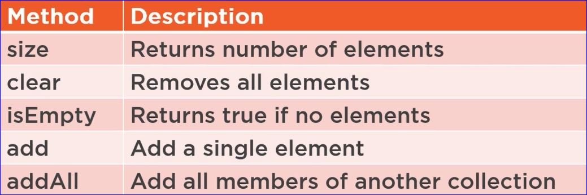
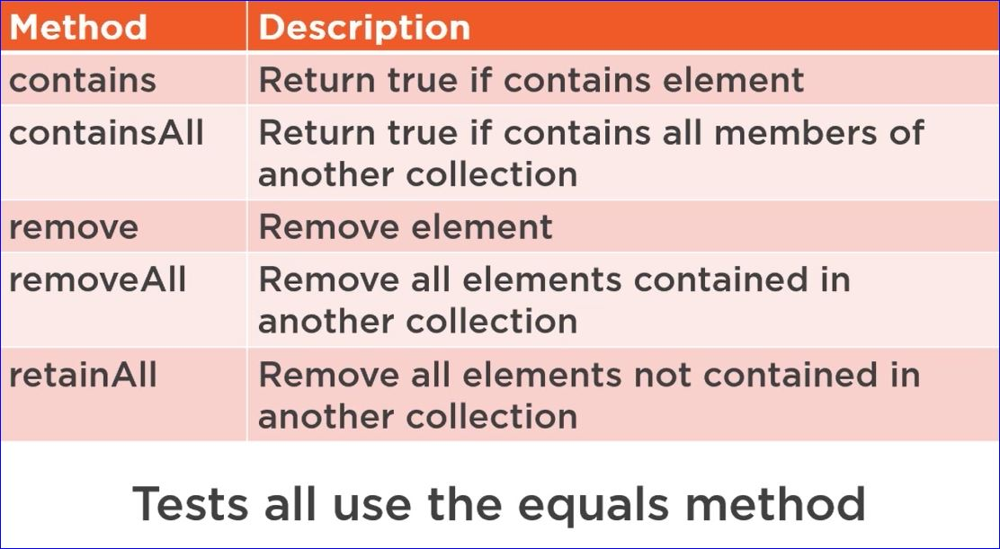
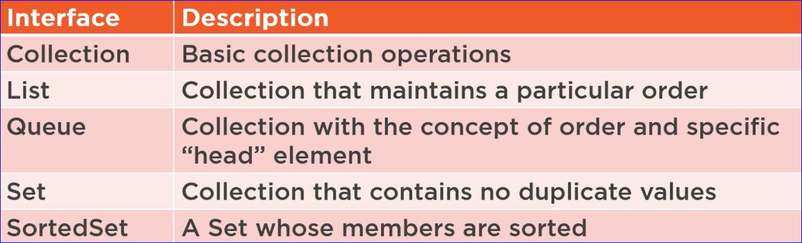
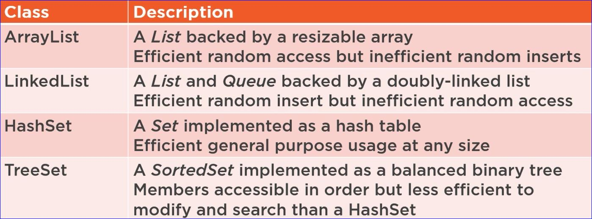
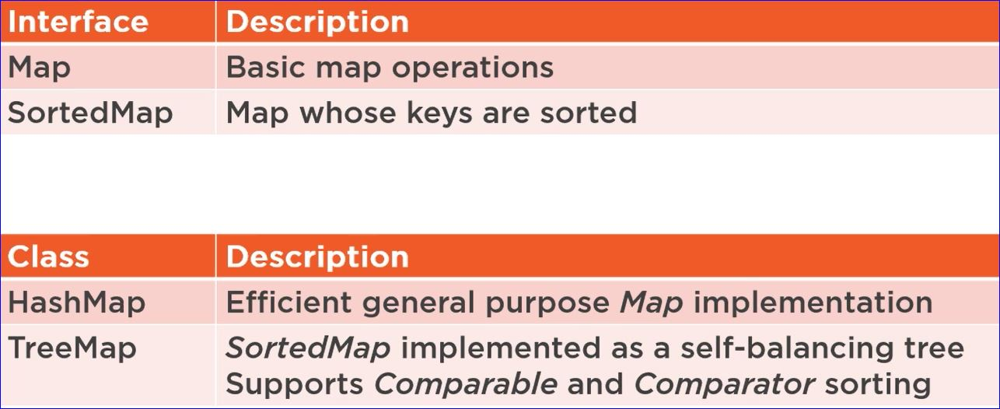
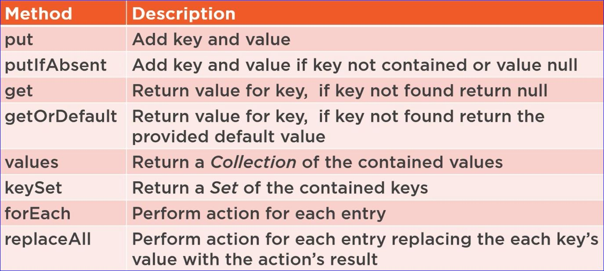
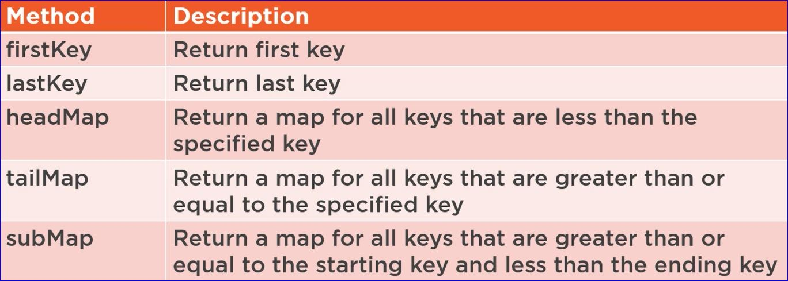

# Working with Collections

## Managing Groups of Data

* **Apps often need to manage data in commonly typed groups**
    * Most basic solution is to use arrays
* **Arrays have limitations**
    * Statically Sized
    * Requires explicit position management
    * Little more than a bunch of values
* **Collections provide more powerful options**

## The Role of Collections

* **Collections hold and organize values**
    * Iterable
    * Can provide type safety
    * Tend to dynamically size
* **A wide variety of collections are available**
    * May be a simple list of values
    * Can provide optimization or sophisitication
        * Ordering
        * Prevent duplicates
        * Manage data as name/value pairs

## Collections and Type Safety

* **By default collection hold Object types**
    * Must convert return values to desired type
    * Doesn't restrict types of values added
* **Collections can be type restricted**
    * Uses the Java concept of generics
    * Type specified during collection creation `ArrayList<String> list = new ArrayList<>();`
* **Collection type restriction is pervasive**
    * Return values appropriately typed
    * Adding values limited to appropriate type

## Collection Interface

* **Each collection type has its own features**
    * But there are many that are common
* **Collection interface**
    * Provides common collection methods
    * Implemented by most collection types
        * Mat collections are notable exception
    * Extends Iterable interface

## Common Collection Methods

## Java 8 Collection Methods

* **Java 8 introduced lambda expresions**
    * Simplify passingcode as arguments
* **Collection methods that leverage lambdas**
    * forEach
        * Perform code for each member
        * `list.forEach(m -> System.out.println(m.getLabel()));`
    * removedIf
        * Remove element if test is true
        * `list.removeIf(m -> m.getValue().equals("abc"));`

## Converting Between Collections and Arrays

* **Sometimes APIs require an array**
    * Often due to legacy or library code
* **Collection interface can return an array**
    * toArray() method
        * Returns Object array
    * toArray(T[] array) method
        * Returns aray of type T
* **Array content can be retrieved as collection**
    * Use Arrays class' asList method

## Collection Types

* **Java provides a wide variety of collection**
    * Each with specific behaviors
* **Collection interfaces**
    * Provide contract for collection behavior
* **Collection Classes**
    * Provide collection implementation
    * Implement 1 or more collection interfaces

## Common Collection Interfaces

## Common Collection Classes

## Sorting

* **Some  collections rely on sorting**
    * Two ways to specify sort behavior
* **Comparable interface**
    * Implemented by the type to be sorted
    * Type specifies own sort behavior
        * Should be consistent with equals

* **Comparator interface**
    * Implemented by type to perform sort
    * Specifies sort behavior for another type

## Map Collections

* **Maps store key/value pairs**
    * Key used to identify/locate values
    * Keys are unique
    * Values can be duplicated
    * Valuse can be null

## Common Map Types

## Common Map Methods

## Common SortedMap Methods

