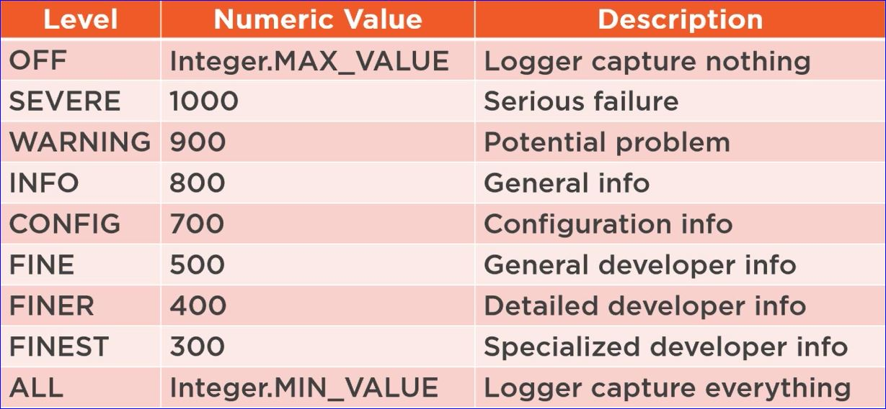
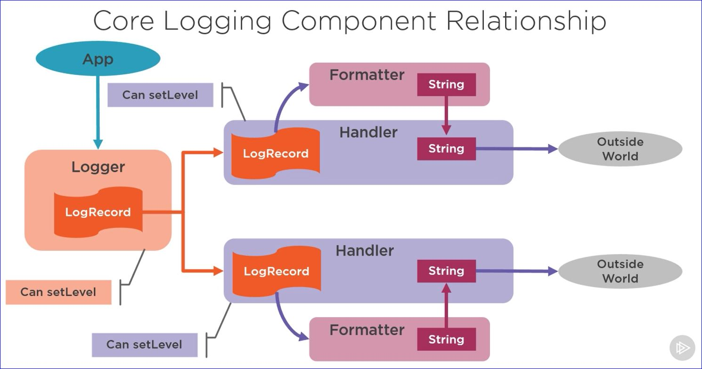

# Capturing Application Activity with the Java Log System

## Log System

### We need a way to capture app activity

* Record unusual circumstances or errors
* Track usage info
* Debug

### The required level of detail can vary

* Sometimes need lots of details
    * Newly deployed app
    * App is experiencing errors
* Generally need less detail
    * App is mature and stable

### Java provides a built-in solution

* java.util.logging

## Logging Levels

### Levels control logging detail

* Each log entry is associated with a level
    * Included with each log call
* Each logger has a capture level
    * Use setLevel method
    * Ignores entries below capture level

### Each Level has a numeric value

* 7 basic log levels
* 2 special levels for Logger
* Can define custom levels
    * *Should generally be avoided*

#### Logging Levels

## Core  Log Components

### Consists of 3 core components

#### Logger

* Accepts app calls

#### Handler

* Publishes logging information
* A Logger can have multiple

#### Formatter

* Formats log info for publication
* Each Handler has 1 formatter

