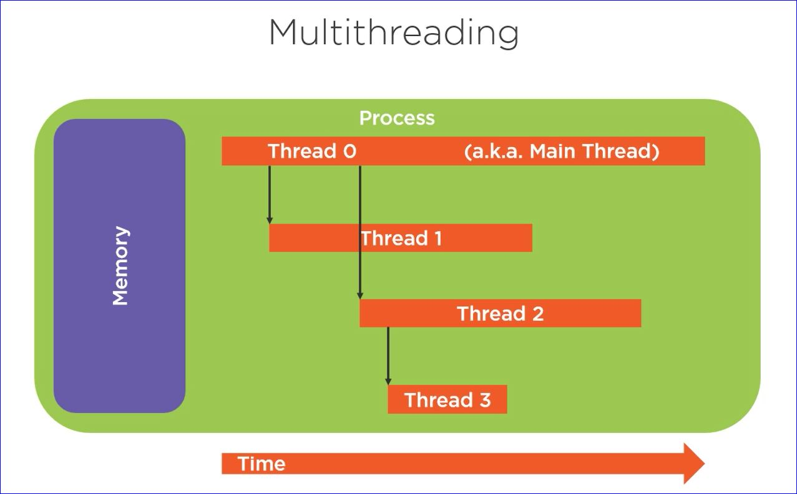

# Multithreading and Concurrency

## A Quick Look at the Basics

### Process

* Instance of a program / application
* Has resources such as memory, etc.
* Has at least one thread

### Thread

* Sequence of programmed instructions
* The thing that executes a program's code
* Utilizes process resources
* A thread may create another thread thereby creating multi-threading or more than one thread running inside a process at the same time

* Because these threads are running at the same time we have what's known as _concurrency_

## The Case for Multithreading

### Can enable more complete CPU use

* Threads often wait on non-CPU tasks
    * Interacting with storage, networks, etc.
* Most computers have multiple CPU cores
    * Allows things to run in parallel

### Why does this matter?

* Can reduce perceived execution times
    * Less wall-clock time passes; however, the same amount of cycle-time passes.  A process takes the time it takes to run, but when those processes are running concurrently it _seems_ to take less time

## The Move to Multithreading

### Multithreading is an explicit choice

* Musst break the problem into parts
* Must handoff the parts for processing

### java provides differing levels of abstraction

* Supports very direct handling
    * manual creation & coordination
* Supports higher level handling
    * Simplified creation & coordination

## Java Threading Foundation

### Limited threading abstraction

* Very close to the standard OS behavior
* Each thread started for a specific task
    * Terminates at end of task

### Requires explicit management

* Responsible to manage coordination

### Exception tied to thread

* Each thread must handle it's own exceptions

## Threading Foundation Types

### Runnable interface

* Represents a task to be run on a thread
* Only member is the run method

### Thread class

* Represents a thread of execution
* Can interact with and effect thread state
* Begin execution with start method

## Abstracting Thread Management with Thread Pools

### Java offers thread pools

* Creates a queue for tasks
* Assigns tasks into a pool of threads
* Handles details of managing threads

## Thread Pool Types

### ExecutorService interface

* Models thread pool behavior
* Can submit tasks
* Request and wait for pool shutdown

### Executors class

* Methods for creating thread pools
    * Dynamically sized pools
    * Size limited pools
    * Pools that schedule tasks for later