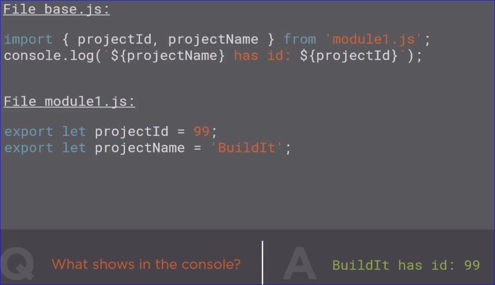
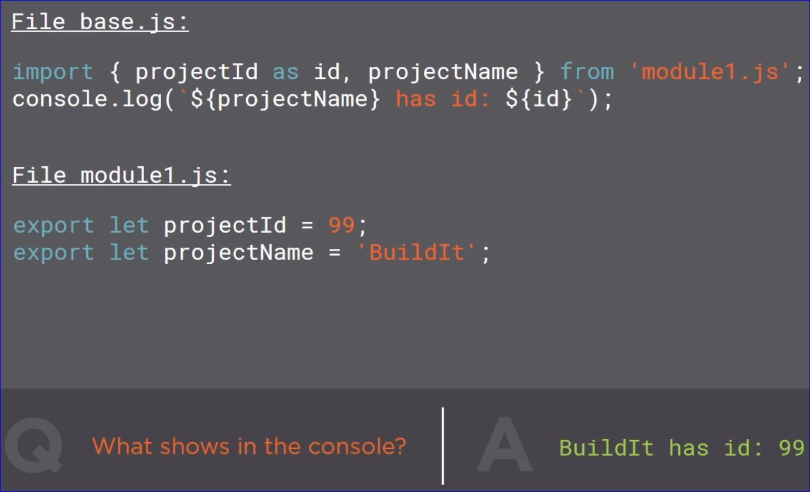

# Rapid ES6 Training

- Mark Zamoyta

## New ES6 Syntax

### let, const and Block Scoping

- **let** allows declaration of **variables** that are limited in scope to the block, statement or expression on which it is used.  This is unlike the **var** keyword, which defines a variable globally, or locally to an entire function regardless of block scope.

#### Example: let and Block Scoping

```javascript
'use strict'
let productId = 12;
{
    let productId = 2000;
}
console.log(productId); // yields 12 because of block scoping
```

- The **const** keyword defines a constant in JavaScript similar to other languages.
- The name of a constant is generally declared in all UPPER CASE
- When declaring a _const_ it must be initiallized to a value
- Once a constant is initialized it can't be changed without re-initializing
- _const_ uses block scoping

### Arrow Functions

- The "fat" arrow symbol **=>**
- Some people refer to this as "maps to" or "goes to"
- A good way to think of it is "this input results in this outpup"
- The arrow is shorthand making it possible to leave off the _function_ and _return_ statements of a function

```javascript
'use strict'
// No input to the function use empty ()
var getPrice = () => 5.99;
console.log(typeof getPrice); // yields 'function'
console.log(getPrice()); //yields 5.99

// If there is one input don't need to use ()
var getPrice = count => count * 4.00;
console.log(getPrice(2)); // yields 8

// If there are more than one input need the ()
var getPrice = (count, tax) => count * 4.00 * (1 + tax);
console.log(getPrice(2, .07)); // yields 8.56

//using a whole block
var getPrice = (count, tax) => {
    var price = count * 4.00;
    price *= (1 + tax);
    return price; // need to specify the return so the function block will return something
}
console.log(getPrice(2, .07)); // yields 8.56
```

- Arrow functions may save a few keystrokes but the real reason for them is to handle the keyword *_this_* in the function

```javascript
'use strict'
document.addEventListener('click', function (){
    console.log(this); // yields #document
});

// Same code using an arrow function
document.addEventListener('click', () => console.log(this)); // yields windows {...} set to the context of the code we're in and more accurate

var getPrice = ()
    => 5.99;
console.log(typeof getPrice); // yields SyntaxError: unexpected token =>
// when using arrow functions the => can't be on it's own line.
```

### Rest and Spread

- **Rest** refers to gathering up parameters and putting them into a single array.  This is indicated by "..."

```javascript
'use strict'
var showCategories = function (productId, ...categories) {
    console.log(categories instanceof Array); // yields true meaning categories is an array
    console.log(categories); // yields ['search' 'advertising']
};
showCategories(123, 'search', 'advertising'); 

```

- **Spread** refers to spreading out the elements of an array. This is also indicated by "..."

```javascript
'use strict';
var prices = [12, 20, 18];
var maxPrice = Math.max(...prices);
console.log(maxPrice);
```

### Object Literal Extensions

```javascript
'use strict';
var price = 5.99, quantity = 30
var productView = {
    price,
    quantity
};
console.log(productView);  // yields {price: 5.99, quantity: 30}
```

```javascript
'use strict';
var price = 5.99, quantity = 10
var productView = {
    price,
    quantity
    calculateValue() {
        return this.price * this.quantity
    }
};
console.log(productView.calculateValue());  // yields 59.90000000006
```

### for ... of Loops

- **for ... of loops** can be used with _strings_ and _arrays_ and anything else exposed as an iterable

```javascript
var categories = ['hardware', 'software', 'vaporware']; //categories is an array of iterables
for (var item of categories){
    console.log(item);
}
```

### Octal and Binary Literals

```javascript
'use strict'
var value = 0o10;
var value1 = 0b10;
console.log(value); // yields 8 0o indicate octal and 10 = 8
console.log(value1); //yields 2
```

### Template Literals

```javascript
'use strict'
let invoiceNum = '1350';
console.log(`Invoice Number: ${invoiceNum}`);
// output: Invoice Number: 1350
```

## ES6 Modules and Classes

- To demonstrate modules use a template HTML file such as:
- Get traceur from github _google/traceur-compiler_
- Get es6 module loader from _ModuleLoader/es6-module-loader_

```html
<!DOCTYPE html>
<html>
<head>
  <script src="traceur.min.js"></script>
  <script src="es6-module-loader-dev.js"></script>
</head>
<body>
  <script>
    System.import('./base.js');
  </script>
</body>
</html>

```

### Module Basics

- Modules infer 'use strict' automatically
- Modules load first
- **import** and **export** commands are the method of moving between modules and sharing information

#### Example 1

```javascript
//File base.js
//************************************
import { projectId} from 'module1.js';
console.log(projectID)

//File module1.js
//************************************
export lete projectID = 99;

// Output: 99
```

#### Example 2





- **import** statements get hoisted to the top of the file and run first

### Class Fundamentals

- A **class** has a _typeof_ function

```javascript
class Task {

}
let task = new Task();
console.log(typeof task);
//task is an object which makes it an instantiated class
```

#### Call a method on a class

```javascript
class Task {
  showID() {
    console.log('99');
  }
}
let task = new Task();
task.showID();
//99 shows in the console
```

