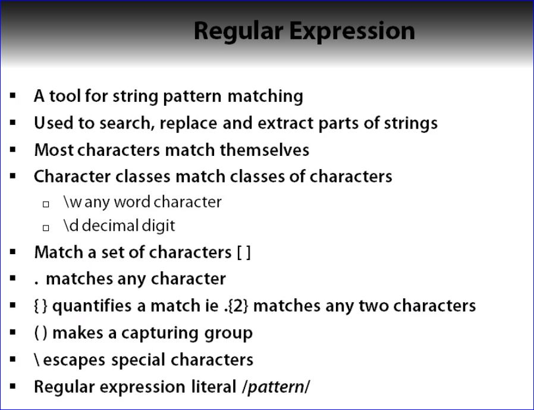

# JavaScript Fundamentals

**Author:** Liam McLennan

[Plural Sight](http://www.pluralsight.com)

A really good JavaScript reference library can be found at [Mozilla Developer Network (MDN)](https://developer.mozilla.org)

## Building Blocks

### Objects

- Everything except string, number, boolean, null and undefined is an object
- Objects are collections of properties
- Declared with the object literal notation

```javascript
// object literal notation

var myObject = {
  firstValue: 'a',
  secondValue: 2
};
```

#### toString()

- toString() converts the output to a string type

```javascript
// toString()
write([1,2,3].toString()); // yields 1,2,3 as a string
```

#### Nested Objects

```javascript
// nested objects

var person = {
  address: {
    number: 1,
    street: "brunswick"
  }
};
```

## Functions

- Functions **are** objects


### Standard Function Declaration


### Named and Assigned Function

- If you do this the function must be invoked by the variable not the name of the function


### Anonymous and Assigned Function


### Anonymous and Immediately Invoked


## Invocation


### Arguments Object

The **Arguments Object** is a special magical local variable available within all functions

- It contains the functions parameters
- Indexed like an array
- Has a length property like an array
- It is **NOT** actually an array; it is an **object**

#### Example 1

```javascript
// arguments is not an array
function argumentsType() {
  write("length of arguments: " + arguments.length);
  write("arguments[0]: " + arguments{0});
  return typeof arguments:
}
Write("Type of arguments: " + argumentsType("a") + "<br/>");

//function that can be called with any number of parameters

function add() {
  var total = 0;
  for (var i = 0; i < arguments.length: i++) {
    total+= arguments[i];
  }
  return total;
}

write(add());
write(add(5));
write(add(2,3,8,2));
```

### Recursion

JavaScript functions support **recursion** meaning a function can call itself

- Make sure there is a definite break in the function

#### Example 2

```javascript
//a recursive function calls itself
function factorial(n) {
  if (n === 0 || n === 1) {
    return 1;
  }
  return n * factorial(n-1);
}

factorial(5); //resutl is 120
```

### Closure

- Functions may be nested
- Inner functions have access to variables defined outside of the inner function.  This is known as closure.

## Control Flow

### Error Handling - throw

- Throw an exception when an unusual error condition occurs
- Exceptions are thrown using the 'throw' statement
- The exception object can be accessed when the exception is caught

#### Example 3

```javascript
if (somethingGoesWrong) {
  throw {
    name: "SomethingWentWrongError",
    message: "Something went wrong. You should fix it."
  };
}
```

- When an exception is thrown within a 'try' block it can be caught and handled within a 'catch' block.
- A 'finally' block can be used to guarantee execution of some statements, even in the event of an exception


## Types and Libraries

- JavaScript doesn't include very many libraries/APIs out of the box. Additional libraries/APIs must be added on.

### String

- **replace(from, to)**: replaces the first argument with the second
- **toLowerCase()**: makes all the characters lowercase
- **toUpperCase()**: makes all the characters uppercase

### Number

- All numbers are floating point data types.  They are all of type **_number_**
  - Decimal fractions are not exact
- **toFixed(n)**: returns the number to n decimal places

### Arrays

- Arrays and objects are the only two data structures available in JavaScript so they are used alot.

### Regular Expressions



### JSON

- JavaScript Object Notation
- Uses JavaScript object literals as a data format
- Lightweight, readable alternative to xml
- increasingly used in AJAX web applications

#### EXAMPLE: JSON vs XML


#### EXAMPLE: ParseFloat


