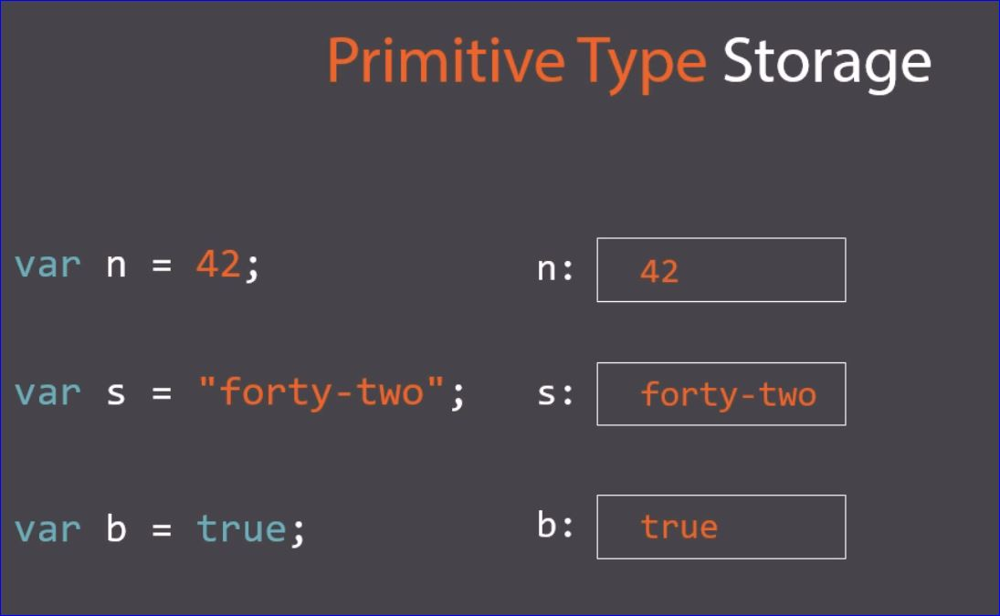
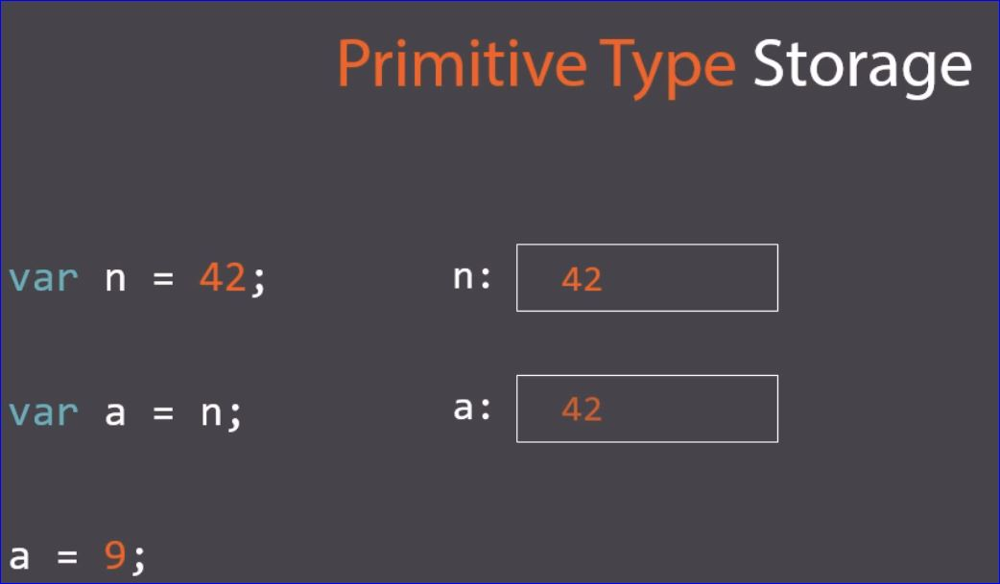
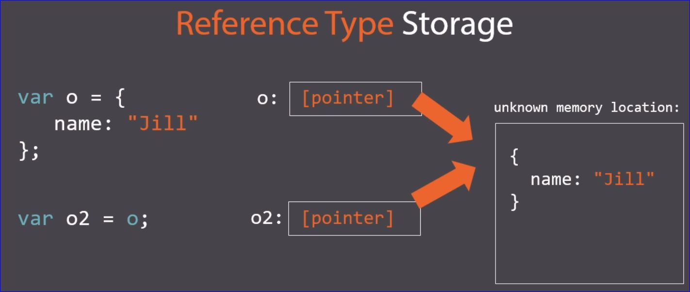
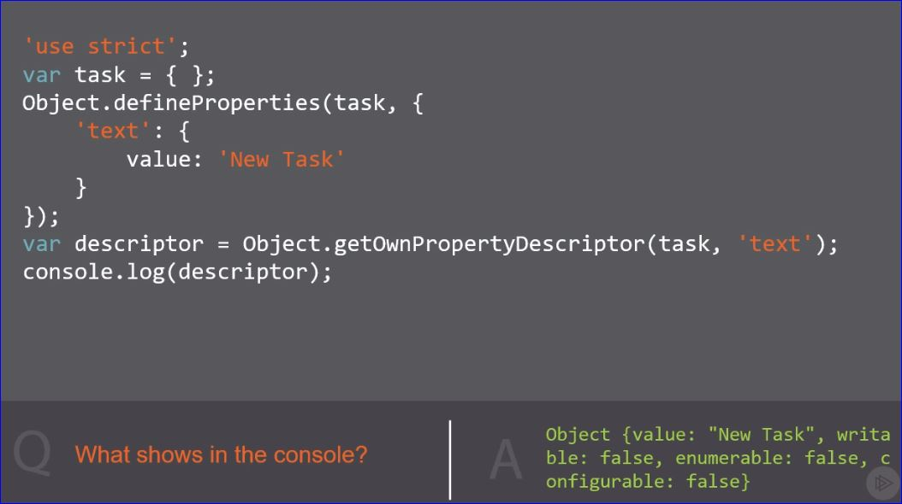

# Rapid JavaScript Training

- **Mark Zamoyta** markzamoyta@gmail.com

## JavaScript Basics

- The preferred place for **\<script>\</script>** tags in the **\<body>\</body>** at the end so your page can load in the browser while the script is running.

- The **defer** keyword delays the execution of the script until other scripts listed after have run..._not a good idea to use defer_

```html
<script defer src="js/app.js"></script>
<script src="js/salesOrder.js"></script
```

- When a **var**iable is not initialized it's value and type are always set to undefined

### Simple Datatypes

- String
- Number
- Boolean

### Complex Datatypes

- object
  - **JSON** is of type objects
  - **Arrays** are of type object
  - **null** is of type object
- function

### Function Fundamentals

- The reason for creating/declaring functions is so they may be called over and over; otherwise, there really isn't much use.

#### Example of the simplest type of function

```javascript
function printOrder() {
  console.log('Printing order.');
}

printOrder();
// Shows Printing order. in the console
```

#### Example of passing a parameter

```javascript
function printOrder(orderID) {
  console.log('Printing order:' + orderID);
}

printOrder('9002');
// Shows Printing order: 9002 in the console
```

#### Example of returning a value from a function

- The **return** keyword is how we get information back from a function
- Assign a variable to the function to store the value being **return**ed

```javascript
function calcTotalPrice(quantity, price)
{
  return quantity * price;
}

var totalPrice = calcTotalPrice(2, 4.00);
console.log(totalPrice);
// Shows 8 in the console
```

#### Function Expression Example

- This is an anonymous function meaning it doesn't have a name
- A function expression delcares a function and assigns it to a variable
- The _typeof_ the variable is **function**
- When _activateOrder_ is called it will write a message to the console
- Assigning functions to a variable is fairly common in javaScript

```javascript
var activateOrder = function(){
  console.log('Order activated.');
};

activateOrder();
// Order activated. shows in the console
// If the () are left off nothing will print since it is just a reference to a variable and doesn't execute anything
```

### If and Switch Statements

- if want multiple cases to equate to the same value they can be lined up
- if no cases match the condition the statement returns undefined

```javascript
var orderType = 'unknown';
var shipMethod;

switch (orderType){
  case 'business':
  case 'personal':
    shipMethod = 'UPS Ground';
    break;
  default:
    shipMethod = 'USPS';
    break;
}
console.log(shipMethod);
//USPS shown in the console
```

### while and do...while Statements

- **while** is used to test a condition and do something as long as that condition is true
- **do...while** will always execute once and then check the condition

### for and for...in

#### for

```javascript
var lineItemCount = 3;

for (var i=0; i<lineItemCount; i++)
  console.log(i);
// 0 1 2 shows in the console
```

#### break

- **break** is used to exit a loop

```javascript
var lineItemCount = 5;

for (var i=0; i<lineItemCount; i++)
  console.log(i);
  if (i == 1)
    break;
// 0 1 shows in the console and the function breaks out
```

#### continue

- **continue** is used to go to the next iteration of a loop

```javascript
var lineItemCount = 5;

for (var i=0; i<lineItemCount; i++)
  if (i==1)
    continue;
  console.log(i);
// 0 2 3 4 shows in the console
```

#### for...in

```javascript
// declare a JSON object
var lineItem = {
  product: 'Widget 1',
  quantity: 4,
  price: 9.50
};

// the variable field is used to loop through each property in the object
for (var field in lineItem)
  console.log(field);
// product quantity price shows in the console
```

```javascript
var lineItem = {
  product: 'Widget 1',
  quantity: 4,
  price: 9.50
};

for (var field in lineItem)
  console.log(field + ": " + lineItem[field]);
// product: Widget 1 quantity: 4 price: 9.50 shows in the console
```

### JavaScript Usage Features

```javascript
var $product = 'PRD-4000';
$product += 'X2'; //same thing as $product = $product + 'X2'
console.log($product);
// PRD-4000X2 shows in the console
```

## Variables, Types and Scope

### Hoisting

- Hoisting refers to having access to variables before they are even declared.
  - Two Pass Compilation in JavaScript
    - Pass 1: All declarations are located and identifiers are known by the compiler
    - Pass 2: Execution occurs in Pass 2. Because all variables are known from Pass 1, they may be accessed before they're declared.
- The word "hoisting" is used to describe this behavior because it's as if the declarations are lifted (hoisted) to the top of the function before execution.
- During hoisting, hoisted variables are initialized to undefined; this causes a lot of errors because variables are set to undefined in the first pass; however, they aren't initialized to the correct values until the second pass.  The way to avoid this is to avoid hoisting all together, expecially with variables

### Numbers

- All numbers are of type _number_ in javaScript
- Any number that begins with 0 is _octal_ having a base of 8
  - Octal numbers range from 0 to 7
  - in _strict_ mode Octals aren't allowed

```javascript
var oct = 070;
console.log(oct);
// 56 shows in the console
```

- Hex numbers are much more common.
  - Hex numbers begin with 0x

```javascript
var hex = 0x10;
console.log(hex);
// 16 shows in the console
```

### String

- **string** is a primitive data type
- _length_ is a string property so it is not necessary to when calling length to include ()
- **.trim()** is a function that trims leading and trailing whitespace from a string
- **.toLowerCase()** converts a string to all lower case letters
- **.toUpperCase()** converts a string to all UPPER case letters

### Boolean

- **true** and **false** are specified all lower case or you'll get an error
- "**!!**" will turn any variable into boolean.  The first ! turns it to boolean and negates it.  The second ! reverses the first for the correct boolean value

### undefined & null

- A declared variable that has not be initialized will be set to **undefined**
  - It is not good practice to explicitly let a variable be _undefined_
  - To wipe out a variable, it is good practice to use **null**
- If a variable is set to undefined we know JavaScript did that.  If the variable is set to null we know the code did that.
- When variable is initialized to _null_ it becomes an empty **object**
- JavaScript considers undefined and null to be equal.  So if they are compared with == they evaluate to true.  When compared with === they evaluate to false since undefined is typeof undefined and null is typeof object

### Global Scope

- When working outside a function **this** === **window** evaluates to true indicating global scope

## Operators

### Addition "+"

- JavaScript uses floating point number for decimals; floating point numbers are inaccurate so **5.1 + 3.3** evaluates to 8.39999999 rather than 8.4 as expected.
  - To fix this error:

  ```javascript
  var total = 5.1 + 3.3;
  console.log(total.toFixed(2));
  //8.40 shows in the console
  ```

- JavaScript treats everything as a **string** context first
- Strings are concatenated using "+"

### Subtraction "-"

- Subtraction is defaulted to numeric context with subtraction "-"
- With strings, JavaScript sees the "-" and immediately puts everything in a numeric context

```javascript
var total = 3.8 - 2.1; //evaluates to 1.69999997
console.log(total.toFixed(3)); //evaluates to 1.700 with subraction we use 3 as the rounder
var total = "300" - "200"; //evaluates to 100
var total = "PRD300" - "ITEM200"; //evaluates to NaN
```

- If you have a specialized object that needs to operate as a number you do so by assigning the value of the object to _valueOf_

```javascript
var obj = {
  valueOf: function() {return 100;}
};
var total = 300 - obj;
console.log(total); //evaluates to 200
```

### Unary Operatorys "++ -- +value -value"

- **++level** or **level++** is the same as saying **level = level + 1**
  - Different is when level is incremented

```javascript
var level = 5;
var nextLevel = ++level; //evaluates to 6
var nextLevel = level++; //evaluates to 5 since level == 5 and is assigned then incremented
```

- Use **"-"** to flip the positive/negative value of a number

```javascript
var value = -42;
value = -value; //evaluates to 42
```

### Bitwise Operators

```javascript
var num1 = parseInt('1010', 2);
var num2 = parseInt('0110', 2);
var total = num1 & num2; //the & is the bitwise operator. we want to and these two numbers together.  Where 1 lines up with 1 it is 1 - evaluates to  10
//essentially, the comparing down so 1,0; 1,0; 1,1; 0,0
//working with binary numbers the bits are important not the decimal value
var total = num1 | num2; // | is the bitwise or.  evaluates to 1 if there is a 1 in the compare.  Evaluates to 1110
var total = num1 ^ num2; // ^ is exclusive or; to get 1 to come down one value must be 1 and one value must be 0 - Evaluates to 1100
```

### Miscellaneous Operators

#### compound operators

- **+=**
- **-=**
- ***=**
- **/=**
- **%=**
- **<<=**

```javascript
var total = 6;
total += 4; // simply adding 4 to the value of total.  Same thing as total = total + 4;
```

```javascript
var total = 1;
total <<= 2; // shift left 2: take 1, multiply it by 2 then do it a again - results in 4
var total = 4;
total >>= 1; //shift right 1: take 4 devide by 2 once - results in 2
```

## Arrays and Reference Types

### Understanding Reference Types

#### Primitive Storage

- Set a variable to some value
- The runtime engine creates the variable, assigns it some storage and insert the assigned value



- Storage is allocated for each new variable assigned and values get copied around a lot.
- In the following example n is assigned 42, a is then assigned n which is 42, finally a is reset to 9 and n is still 42.



#### Reference Type Storage

```javascript
//create a variable o and set to object containing a property, name: set to "Jill"
var o = {
  name: "Jill"
};
```



- If a new value is assigned to o2 it changes the reference value and the value of o is also changed.

#### Reference Types

- Objects
- Arrays
- Dates
- RegExps's (Regular Expressions)
- Functions
- Primitives (via Wrappers)

### Array Fundamentals

```javascript
// Declare an array
// The following are all valid methods for declaring an array
var entries = new Array('trains', 42, true);
var entries = Array('trains', 42, true);
var entries = ['trains', 42, true;]

// Access elements of an array
console.log(entries[0]); // yields trains
// if an array position  is call that doesn't exist undefined is returned
```

#### Set the array size

- declare a new array and initialize it with a certain number of elements

```javascript
var entries = new Array(5);
var ratings = [5, 2, 4];

entries.length = 10; //resets to 10

//expand the array to 42 elements and assign element 42 Cars
entries[42] = 'Cars';

// append to an array
entries[entries.length] = 'Bicycles';

// list the elements in an array
console.log(entries.toString());

// list the elements in an array of numbers
console.log(entries.valueOf());

// join the elements of an array with the indicated string between
console.log(ratings.valueOf(' | '));
```

### Array Features

```javascript
var ratings = [];
ratings.push(5);
ratings.push(2, 4); // [5, 2, 4]
ratings.pop(); // [5, 2]

ratings.shift(); // [2]
ratings.unshift(3); // [3, 2]
ratings.concat([4, 5, 6], 7, 8); // [3, 2, 4, 5, 6, 7, 8]
ratings.slice(2); // [4, 5, 6, 7, 8]
ratings.slice(2, 3); // [5, 6]
ratings = [4, 5, 6, 7, 8];
ratings.slice(-2); // [7, 8]
ratings = [4, 5, 6, 7, 8];
ratings.splice(1,2); // [4, 7, 8]
ratings.splice(2, 0, 99); // [4, 7, 99, 8] insert 99 at index 2
//starting at index delete n elements and insert indicated elements
ratings = [1, 2, 3, 4];
ratings.reverse(); //4,3,2,1
ratings.sort(); //1,2,3,4
```

### Date Fundamentals

```javascript
var dt = new Date();
console.log(dt); // Tue Mar 06 2018 12:10:58 GMT-0700 (Mountain Standard Time)

var dt = Date.now();
console.log(dt); // 1520363664187 the number of seconds since January 1, 1970 to now

var dt = new Date(Date.now());
console.log(dt); // Tue Mar 06 2018 12:17:17 GMT-0700 (Mountain Standard Time)

var dt = new Date();
console.log(dt.toDateString()); // Tue Mar 06 2018
console.log(dt.toTimeString()); // 12:18:24 GMT-0700 (Mountain Standard Time)
console.log(dt.getFullYear()); // 2018
```

- Many more data functions that can be looked up online (Search on MDN **Date**)

### Regular Expressions RegExp

```javascript
var pattern = new RegExp('am', 'g');
// look for all instances of 'am' in a string.  The 'g' means global
var pattern = /am/g //exact same thing in shorthand

// find all results of a search
var blogText = "Sam I Am";
var pattern = /m/g;
var result = pattern.exec(blogText);
while (result) {
  console.log(result.index);
  result = pattern.exec(blogText);
}
// 2 7

// match search results of pattern
var blogText = "Sam I Am";
var pattern = /am/gi; //g = global i = case insensitive
var result = blogText.match(pattern);
console.log(result); // ["am", "Am"]

// OR...................

var blogText = "Sam I Am";
var pattern = /[aA]m/g;
var result = blogText.match(pattern);
console.log(result); // ["am", "Am"]

// "." (dot character)... "." represents any character

var blogText = "Sam I Am";
var pattern = /.m/g;
var result = blogText.match(pattern);
console.log(result); // ["am", "Am"]
```

- Search for **RegExp** on MDN (Mozilla Developers Network)

## Objects, JSON, and Prototypes

### JSON

- **JavaScript Object Notation** - a way of specifying a new object within Javascript code
- Two ways of accessing the properties of an object are using **dot notation** or **bracket notation**

```javascript
var project = Object(); //create a new blank object
project.name = 'Project Phoenix'; //set the name property of the project Object of string type
project.securityLevel = 15; // setting a property of number type
project.updateDueDate = function () {
  return true;
}; // setting a property of type function

console.log(project.updateDueDate());
console.log(project.securityLevel); // dot notation = 15
console.log(project['securityLevel']); // bracket notation = 15 bracket notation is more flexible
var field = 'securityLevel';
console.log(project[field]); // 15
```

#### Example 2

```javascript
var project = {}; // another way to declare an empty object
project.name = 'Project Phoenix';
console.log(project.name);
```

#### Example 3

```javascript
// declare a function and properties
var project = {
  name: 'Project Phoenix',
  securityLevel: 15,
  updateDueDate: function () {
    return true;
  },
  team: ['iquanaboy', 'cactusgirl', 'Buffy'] // set property of type array
};
console.log(project.name);
console.log(project.team[2]);
```

#### Example 4

- Create a JSON object with an array.  The array elements are objects themselves

```javascript
var project = {
  tasks: [
    {
      taskName: 'first'
    },
    {
      taskName: 'second'
    }
  ]
};
console.log(project.tasks[1].taskName); // second shows in the console
```

### Understanding Prototypes

- **EVERY** JavaScript Object has a prototype property; however, we don't always have access to it
- The prototype property is simply and object
- The _prototype_ property is most easily accessed on constructor functions

```javascript
var project = {
  name: 'Project Phoenix'
};
console.log(project.__proto__ === Object.prototype); // true - indicating the objects prototype is set to the global prototype on the Object constructor function
```

### Object.create() and Prototypes

- Using **Object.create()** gives us control over the prototype

```javascript
var project = {
  securityLevel: 2
};
var secretProject = Object.create(project); // create a new empty object with the first argument (project) becoming the prototype
console.log(secretProject.securityLevel);

///secretProject.__proto__.__proto__ === Object.prototype.  project is the prototype of secretProject and Object.prototype is the prototype of project.
```

### Object.defineProperty()

```javascript
var task = { }; //create an empty object

/*
Define a property on the object task
named text with a value of Get this job done!
*/
Object.defineProperty(task, 'text', {
  value: 'Get this job done!',
  writable: true, // this makes the property writable
  enumerable: true // look at every field in the object and log out that field of the property
});
console.log(task.text); // Get this job done!
task.text = task.text + ' ... NOW!';
console.log(task.text); // Get this job done! ... NOW!
for (var f in task)
console.log(f);
```

#### Getter and Setter

```javascript
var task = {
  _dueDate: '1/15/18'
};
Object.defineProperty(task, 'dueDate', {
  get: function() {
    return this._dueDate;
  },
  set: function (newValue) {
    this._dueDate = newValue;
  }
});
task.dueDate = '2/2/18';
console.log(task.dueDate); // 2/2/18
```

#### Object.defineProperties()

- Define multiple properties at a time

```javascript
var task = { };
Object.defineProperties(task, {
  'text': {
    value: 'New Task'
  },
  'dueDate': {
    value: '1/15/18'
  }
});
console.log(task.text + ' Due: ' + task.dueDate);  // New Task Due: 1/15/18
```

#### Object.getOwnPropertyDescriptor

