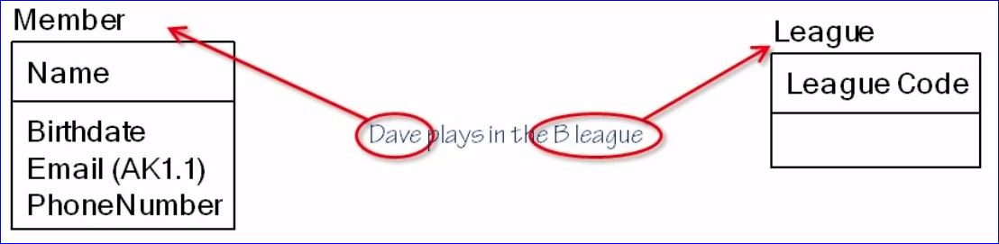
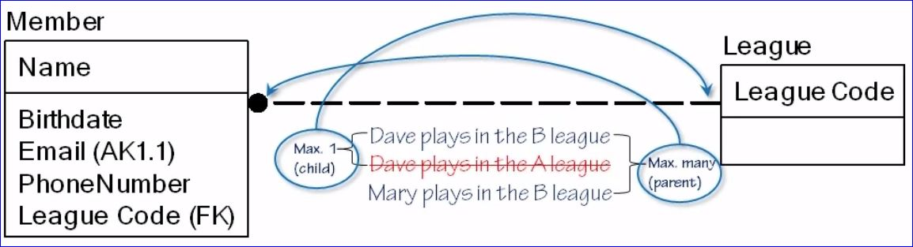
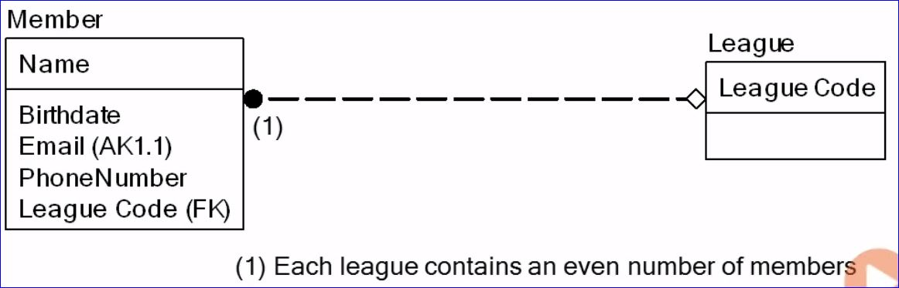
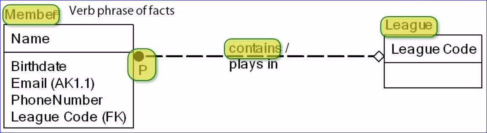

# ER Modeling

- **Many methods, many notations**
  - Entity-Relationship (ER) modeling
  - Using IDEF1X notation in this course

- **Benefits**
  - Relatively easy to understand
  - Hide/expose details when zooming in or out
  - Maps to relational database design

- **Risks**
  - Signing off on ER diagram is wrong
  - ER diagrams are incomplete
  - Notation differences

## Entity types

### Entity

- Everything is an entity; objects, persons, event, abstractions, etc...
- Relevant in the context of the data application
- Entity "instances"

### Entity type

- Class of objects
- Same characteristics

## Attributes

- **Instance level**: A fact about an entity occurrence
- **Abstract level**: A class of facts about instances of an entity type
- **Key attributes**: An attribute that uniquely identifies a record
  - **Composite key**: A combination of attributes to uniquely identify a record
- **Candidate key**: More than one attribute in a table could be used as the key attribute and one is chosen as the _primary key_.  The rest of the candidate keys become _alternate keys_.  Alternate Keys are identified in the model as "(AK1.1)" where 1.1 is the number of the AK.

## Relationships

- Class of facts that associate an instance of an entity type with another instance of an entity type

- **Cardinality**: what is the maximum membership.  1 to Many, 1 to 1, many to many, etc...
  - 1:many relationships are the most common
  - Minimum cardinality: zero or one (optional or mandatory)
- **Foreign key**: are normal attributes that reference the primary key of another entity.

- **Relationship readings**

The above diagram is read like this: **Each league contains 1 or more members**.  Alternatively, it could be ready like this: **Each member plays in 0 or 1 league**.
