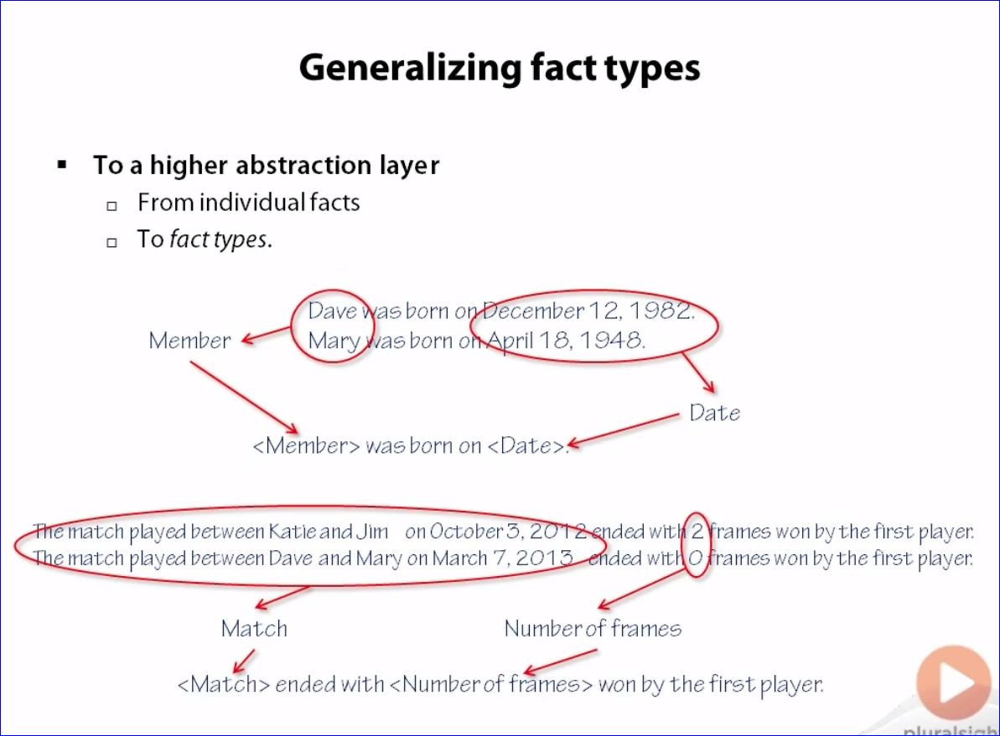
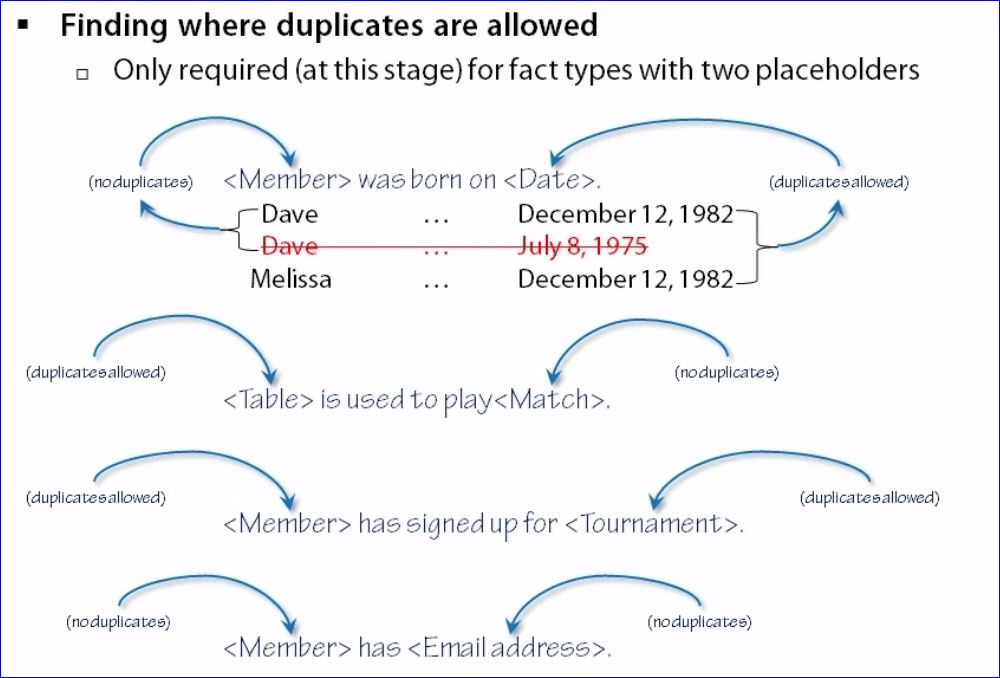

# Creating the Initial ER Model

## Generalizing Fact Types

## Finding Entity Types

- **Representation of fact types**
  - Attribute of an entity type
  - Relationship between entity types
- **Indications for entity types**
  - Used in many fact types
    - **Probably** an entity type
  - Fact type with duplicates allowed in one placeholder, not allowed in the other
    - Placeholder without duplicates **definitely** an entity type
    - No conclusive information from other fact types

