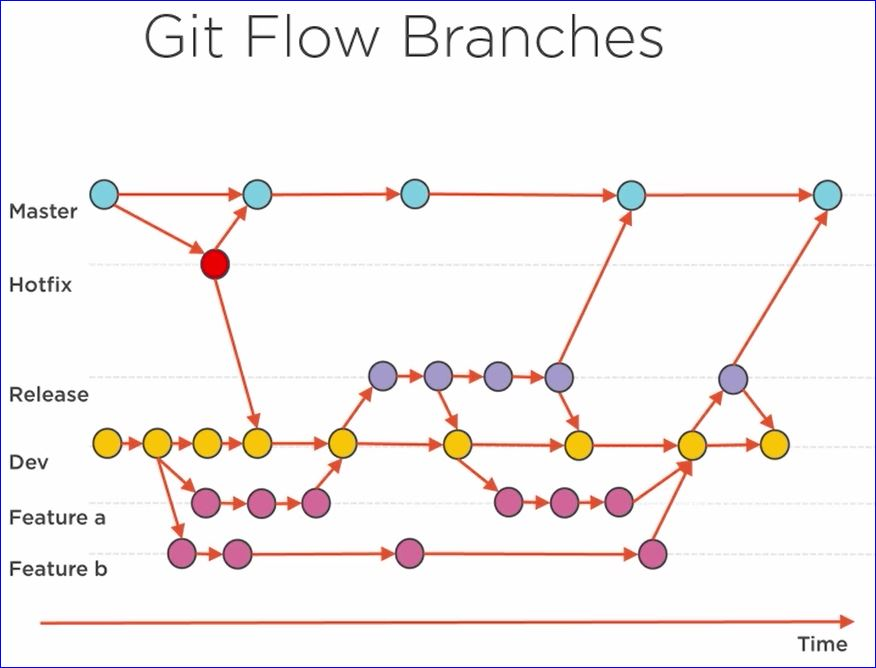
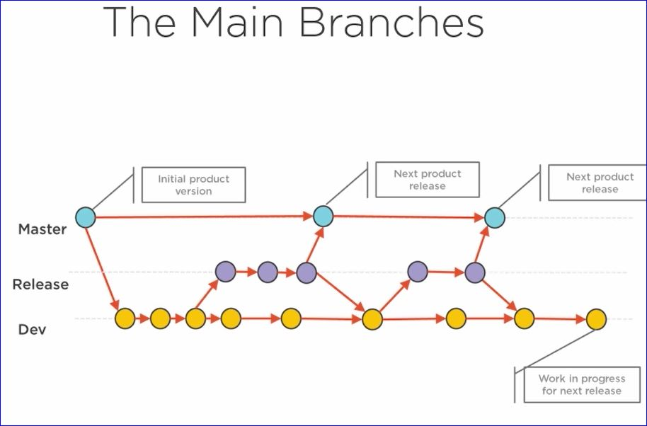
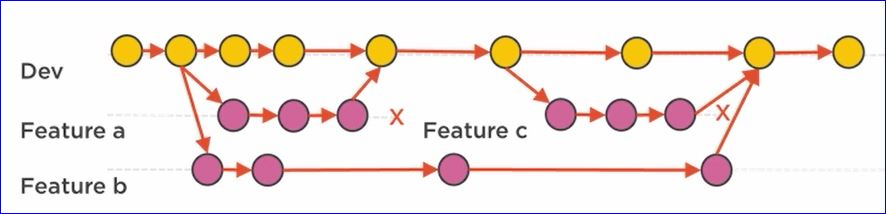
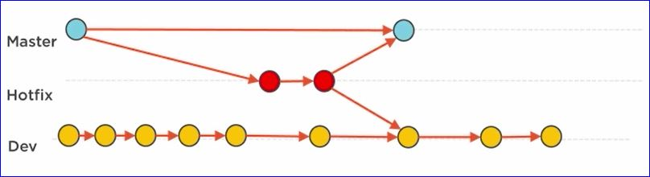

# Source Control & Package Management

## Source Control as Fundamental Enabler of Continuous Delivery

-- One Single Source of Truth --

### Branching

* A branch is created to allow working in isolation from others with the intention of merging the changes back to where you create the branch
    * This is done so as not to frustrate others with your changes, so you don't break their code or ruin their tests.  Also, branching allows you to finish your work without being interupted by others.

### A Word on Branching

* When moving to continuous delivery try to keep branching at a minimum
* Consider alternatives like feature toggles

### Git Flow Branches

#### Master

The Master branch should only contain commits that are fully tested and stable and don't require any additional work.  The assumption is that commits to Master will go into production as fast as possible.

#### Hotfix

The Hotfix branch is used for production incidents that need immediate fixes.  This branch is created from Master and the fix is merged back into Master and also into Dev so the Hotfix will become part of the next release we create in the future.

#### Release

A Release branch is created the moment we start working on a release.  The Release branch is short-lived with the sole purpose of stabilizing the codebase and fixing things that are found in acceptance testing.

#### Dev

All development work is done on the Dev branch.  The Dev branch contains all the committed and tested features that are push up to the repo after the work is done in the so-called Feature branches. We assume this branch is always stable and always production ready.

#### Feature

Developers normally work on features that get added to the system. For every feature they work on they create a local Feature branch and they start working on that particular branch. They commit often to the local branch to safe guard their own work and enable rolling back part of their work if they make a mistake and want to start over. After the developer is done with the feature the feature branch is merged into the Dev branch and then the feature branch is deleted.

### The Main Branches

* Always release from **Master** to production.  The Master branch is **Always** stable and **Always ready to release
* Work is done on **Dev**; however, always strive for a stable releasable product in Dev
* **Release** branch created to stabilize for release

### The Supporting Branches

* Features and any new work are always developed on the **Features** branch.  This can be a new piece of code or a change to existing code.  The reason for the change is irrelevant; the branch is always created and worked from.
* Team members can work together on that branch using their own branch then use push and pull to sync each others repository and Feature branches.
* Peer to peer or via published branch on server.
* Feature branch is always merged to Dev and **DELETED** - never keep the branch

### Hotfix Branches

* Always create a **Hotfix** branch for critical production issues. We make the changes and test them in the new Hotfix branch.
* Merge the Hotfix to **Master** and **Dev** when complete
* **Hotfix** branches are to be deleted after the production incident is remediated.

