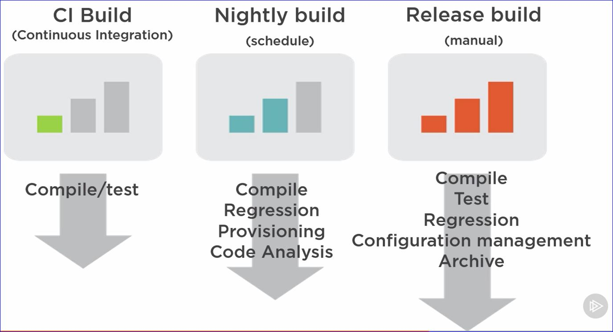
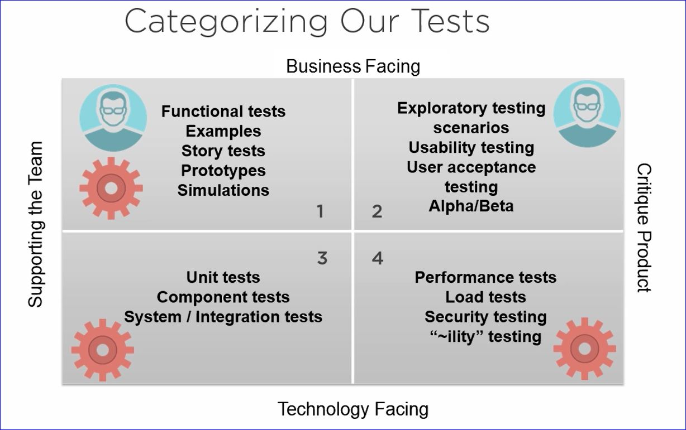
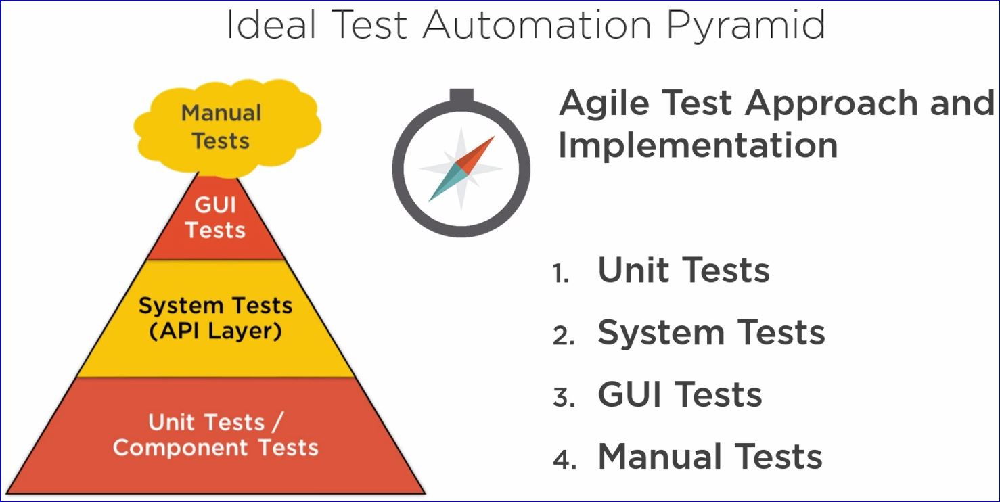
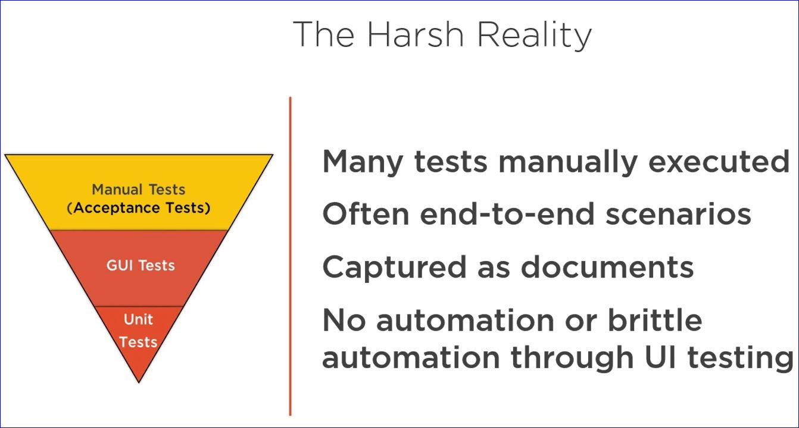

# Configuring Your Builds with Visual Studio and TFS

## Build Fundamentals

"A Build System is a system used to automatically produce all the artifacts required to successfully deploy, test and run our production software"

"Continuous Integration is the fact that we integrate our changes constantly and have a build server build the branch after each commit."

## TFS/VSTS Build Infrastructure and Naming

* **Build Agent** is a process you can run on any machine; it will execute the build on that machine

### Different Builds for Different Purposes

## Ideal Testing vs. The Harch Realities

