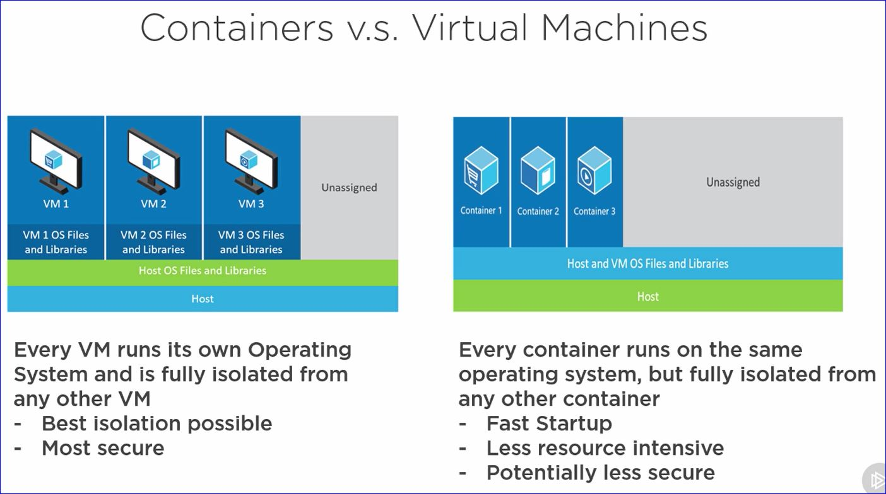

# Using Docker on Windows

<h2 class='green'>Deployment and Containers</h2>

A container is like a virtual machine, but much more lightweight and less resource intensive. A container provides isolation from the OS, so it serves as a sandbox for an application to live in. While a container feels like a VM it is actually just a process isolated from other processes. The concept of containers comes from the Linux world and have been around for a long time.

<h2 class='green'>Containers and Docker</h2>

Docker is the way we can use any container technology with the same command line interface and the same image format. Docker also provides Docker-hub where we can get pre-canned images from.

<h2 class='green'>Containers will revolutionize the way we deploy in the future</h2>

Containers provide an immutable way to build environments. This enables us to move between environments successfully much faster than we used to do
