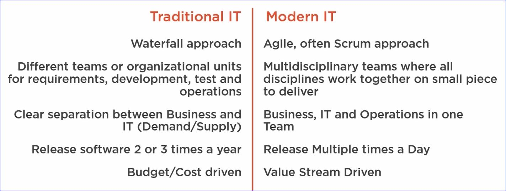

# Pipeline Optimization by Applying DevOps, Application Insights, Sonar Qube and VSTS

"DevOps is the union of people, process and products to enable continuous delivery of value to our end users." -- Donovan Brown

<h2 class='green'>Minimum Viable Product (MVP)</h2>

"A Minimum Viable Product (MVP) is that version of a new product which allows a team to collect the maximum amount of validated learning about customers with theleast effort" --Eric Ries

* MVP means we only build the absolute bare minimum to get a feature into production as quickly as possible. Validated learning is data about how the users are using the feature and what improvements can be made in the next iteration.
    * Build a minimal feature and measure it's usage
    * Add metrics (telemetry data) to learn if it's useful to invest further and validate our assumptions

<h2 class='green'>Monitoring and Insights</h2>

* Application Insights is a tool that is part of the TFS / VSTS suite of tools to monitor an application for performance, usage, diagnostics and availability

