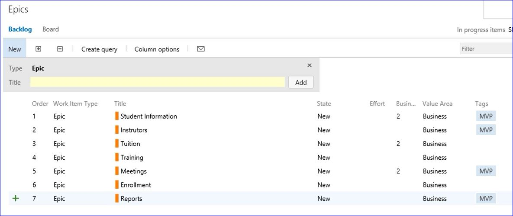
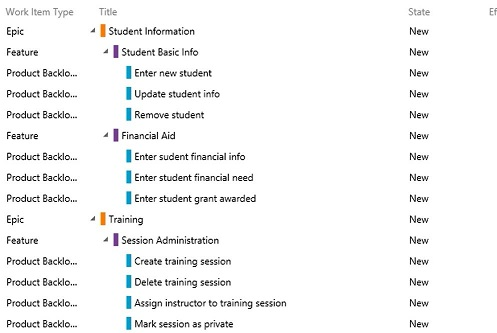

# KanBan

[TFS 2017](http://tx22svaw0051:8080/tfs17)

- Create a project from the Projects portion of TFS 2017
- Od the dashboard click <strong>backlog</strong>.  The backlog section is the <em>work hub</em> of the KanBan capability

## Epic

An epic captures a large body of work. It is essentially a large user story that can be broken down into a number of smaller stories. It may take several sprints to complete an epic. An epic can span more than one project, if multiple projects are included in the board to which the epic belongs.  

### I am using Epics to depict items on the Business Council KanBan and work items or projects on the Applications Development team KanBan

## Feature

The term <strong>feature</strong> is a fairly general term for some part of the functionality of a software, whereas "user story" was invented for and is really only used in the context of agile software development. In practice, they very often coincide, in that one user story consists of implementing a certain feature.

The <em>Features</em> roll up to the Epic and make up the different components of the Epic.

## Backlog Items (User Stories)

Items needing to be completed in each feature / epic for the product to be completed

- Can add <em>tasks</em> to each card to visually indicate progress of work related to the card

## Sprint Planning

- Drag the items planned for a sprint to the appropriate sprint on the left side
- Set the dates to start and end the sprint
- Set the capacity of each person on the team and the primary roles they will play
- Add the tasks / activities for each card in the sprint to show hours needed plan capacity to ensure we aren't over committing the sprint
- As tasks in the sprint are worked on the hours remaining are updated and that updates the burn down chart (upper right)

