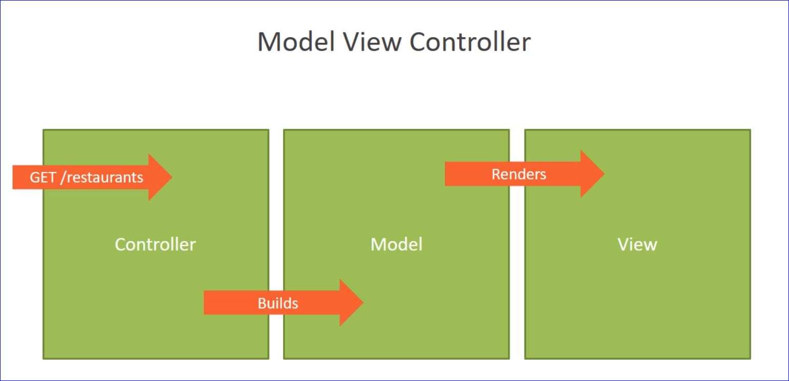
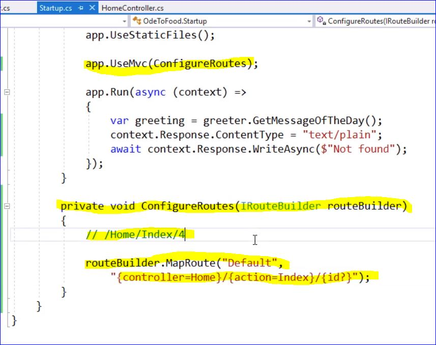
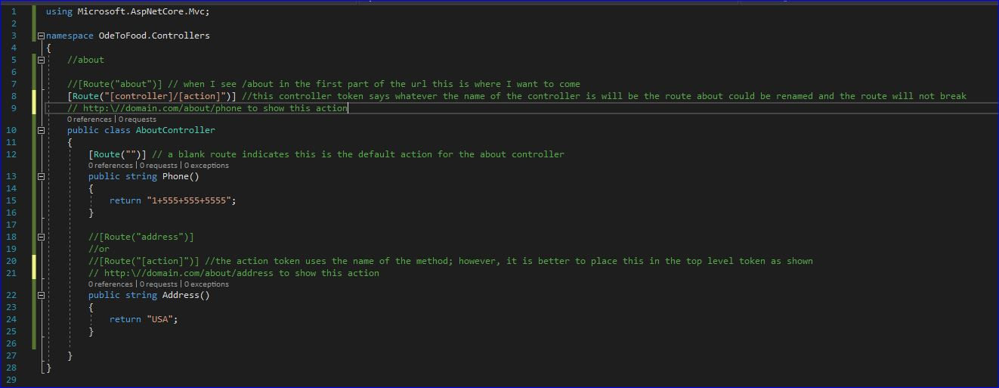
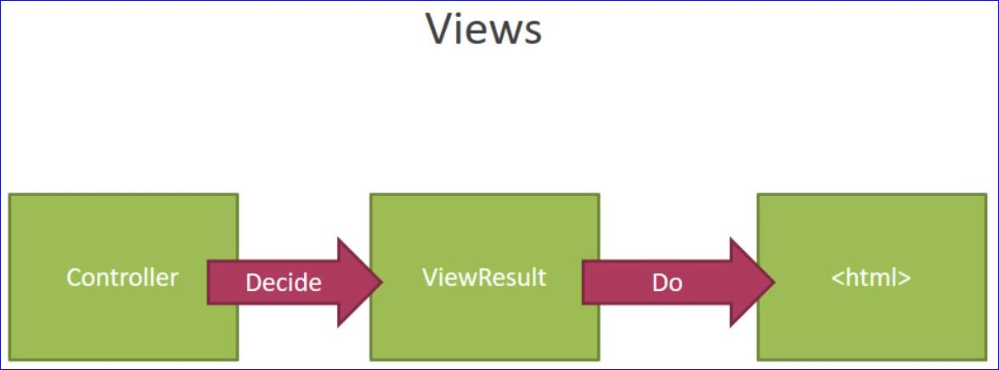

# Building Your First ASP.NET Core Application

- The _controller_ receives the initial HTTP request
  - The controller figures out what needs to be done with the request
- The controller builds a _model_.  The model is responsible for holding the information the user wants to see.
- The controller then selects a _view_ that will render the model into HTML
  - The view takes the information in the model  and uses it to construct and HTML page
  _ The HTML is sent back to the client in the HTTP Response

## Over all idea

- Keep a seperation of concerns
  - The **Controller** is responsible for taking a request and building a model
  - The **Model** carries the information and logic needed into the view
  - The **View** is responsible for transforming the model into HTML
- Three components, each with their own focus on a specific part of the job

## Routing

- **Routing** is how the HTTP requests are sent to the right controller

A controller is just a C# class and an action is a public method that on that class

### Conventional Routing

### Attribute Routing

### Rendering Views

- The most popular method for creating HTML is to use the _razor view engine_ of ASP.net MVC
  - A controller action decides to produce a _ViewResult_ object
  - A ViewResult can carry the name of the Razorview that we want to render.  A view is a file on the file system with a .cshtml extension