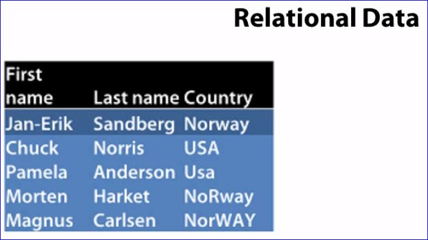
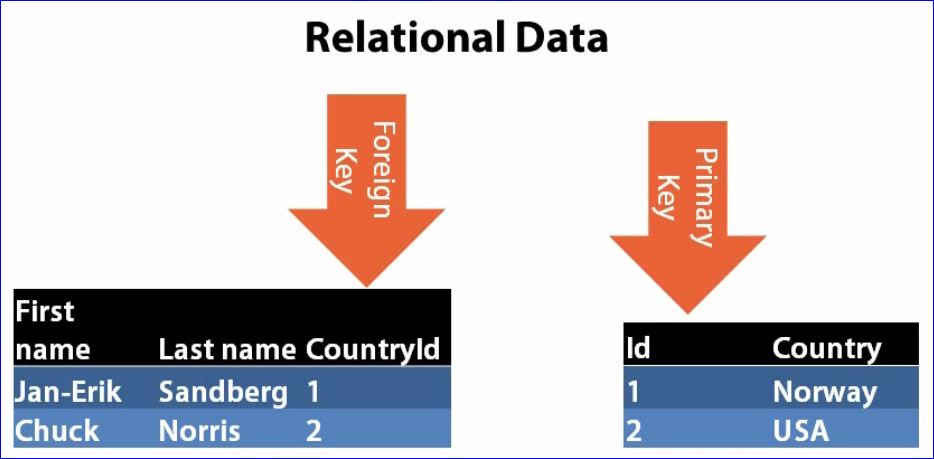
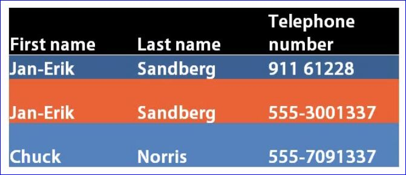
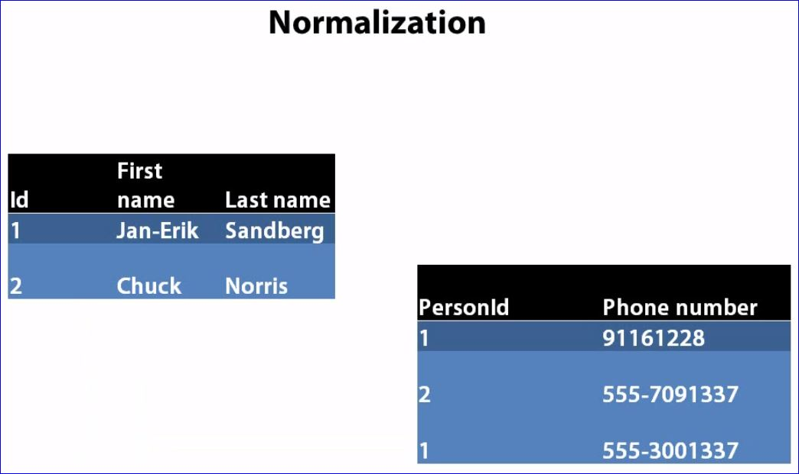

# Database Development

## Relational Data

- Example information in a table might look like this; however, this has many disadvantages from entering the same country multiple times to possible misspellings and more...

- A better example of how to include the same data with relationships between tables

## Normalization

- The following table is not normalized; requiring duplicate information to store multiple phone numbers.

- A better representation of the same data

