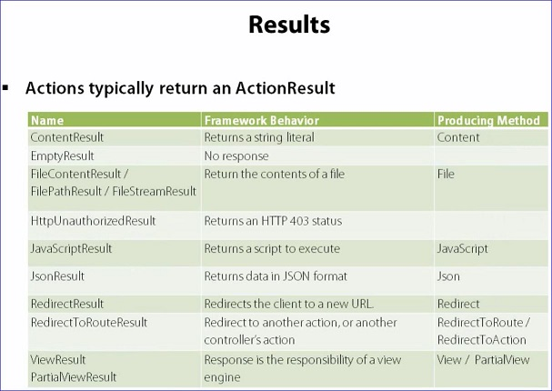
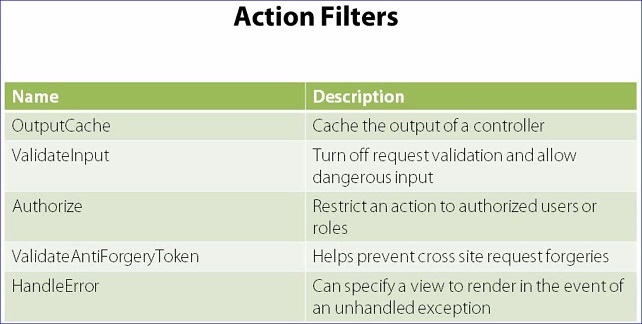

#Routes and Controllers  
  

#Actions and Parameters 
To create a new route enter code similar to the following in the RouteConfig.cs file.  The routes are validated and used in the order they appear in the RouteConfig.cs file.  Order is important.

```csharp
routes.MapRoute("Cuisine",
  "cuisine/{name}",
  new { controller = "Cuisine", action = "Search", name = ""});  //having the name="" indicates the name must be included
  //or 
  new { controller = "Cuisine", action = "Search", name = name=UrlParameter.Optional }); //tells the route it is ok for the name parameter to not exist
``` 
There is no cuisine controller yet...so the app will break giving a 404 error.  Need to create a cuisine controller.  
Right click the controllers folder and select add, controller.
Next need to change the action in the new controller (usually Index) to match the action listed in the route as shown above the action should be "Search"

```csharp
//the CuisineController.cs file would then have an entry looking like this:
public ActionResult Search()
{
	return Content("Hello!");
}
```
To get the name of the cuisine from the same example (as shown above it is not defined) you can add a parameter to the Search command in the controller

```csharp
public ActionResult Search(string name)  //add the name parameter here to search for that parameter
//or
public ActionResult Search(string name = "French" //this sets the default value of name to French
{
	var message = Server.HtmlEncode(name);
	return Content(message);
}
```

#Action Results  


```csharp
//example
public ActionResult Search(string name = "French")
{
  var message = Server.HtmlEncode(name);
  return RedirectToAction("Index", "Home"); //This is an example of using one of the redirect codes from the table above
}
```
#Action Selectors  
```csharp
namespace OdeToFood.Controllers
{
  public class CuisineController : Controller
  {
    [HttpPost] //this says you can only access this ActionResult during an HttpPost message
    public ActionResult Search(string name = "French")
    {
      var message = Server.HtmlEncode(name);
      return Content(message);
    }
    
    [HttpGet] //this says you can access this ActionResult during an HttpGet
    public ActionResult Search()
    {
      return Content("Search!");
    }
  }
}
```

#Action Filters
    
  Action filters allow you use multiple controller actions without having to duplicate code  
  
```csharp
namespace OdeToFood.Controllers
{
  [Authorize] //If the Filter is placed here it tells the application to require a user be logged in to use any action in this controller
  public class CuisineController : Controller
  {
    [Authorize] //If the Filter is placed here it tells the application to require a user be logged in to use the Search action
    public ActionResult Search(string name = "French")
    {
      var message = Server.HtmlEncode(name);
      return Content(message);
    }
  }
}
```
  