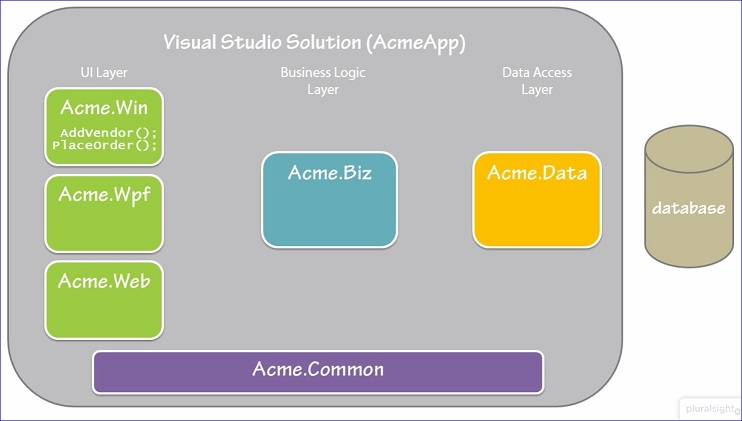

A good course about <b>Entity Framework</b> is <i>Getting Started with Entity Framework 6</i>  

#Classes

A <b>class</b> tells the application how to work with the Application Things.  
A class is a template or mold that provides the specification for the things or objects that the applications works with at runtime.
A class specifies the traits or data and the behavior or operations.

##Types of Classes
- User Interface classes (UI): UI Layer
 - Form classes
 - V/M class or view model
- Domain entity classes: Business Logic Layer
 - Domain model defining the different business model entities and how they are related = Domain Entity Classes (Order, Product, Vendor classes)
 - Repository classes - responsible for managing the in memory repository of data for the application
- Library classes: Common Library Component
 - Logging or Email classes or other functionality common across different layers
- Data Access Classes: Data Access Layer

#Unit Testing
##Unit Testing in Visual Studio
- MS Test
- Steps:
 - Define the test scenarios
  - Valid data
  - Invalid data
 - Generate the tests
 - Execute the tests
  - <i>Defensive Coding in C#</i> (this course will how you how to write clean, maintainable, and testable code, and how to keep that code great using defensive coding techniques