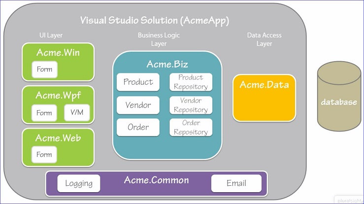

#References and Using
In order to use a class in the same component simply create an instance of the class  
In order to use a class in one component that resides in another component:
- Define a <b>reference</b>
 - Identifies the component containing the class
 - Must use the fully qualified name; for example `Acme.Common.EmailService`
- Use a <b>using</b> directive
 - To use the class without the fully qualified namespace

##References and Using Best Practices
###DO:
- Take care when defining references; <i>References must be one way</i>
- Take advantage of the useing directive

###AVOID:
- Excessive use of the <i>using static</i> directive

#Using a Class
We can access <b>non-static</b> class members by declaring a new instance of the class for example `var currentProduct = new Product();` creates a new instance of the Product class.  We can then use the 
object variable to access members of the Product class; for example, `var result = currentProduct.SayHell();`

For a <b>static</b> class we just call the class directly; for example, `var result = LoggingService.LogAction("");`

##Object vs. Class
###Object
- An object represents one specific thing; for example, Hammer or Saw.  
- An object defines one thing created from the Class template
- Created at runtime with the <b>new</b> keyword
###Class
- A class represents things of the same type; for example, Product.  
- A class also defines the template specifying the data and processing associated wiht all things of that type.
- Created at development time with code
- A <i>static class</i> cannot be instantiated and therefore can't create objects

#Object Initialization
##Different ways to initialize an oject include:
###Setting properties
  ```csharp
  var currentProduct = new Product();
  currentProduct.ProductName = "Saw";
  currentProduct.ProductId = 1;
  currentProduct.Description = "15-inch, steel blade hand saw";
  ```
###Paramertized constructor
  ```csharp
  var currentProduct = new Product(1, "Saw", "15-inch, steel blade hand saw");
  ```
###Object initializers
  ```csharp
    var currentProduct = new Product();
	{
		ProductName = "Saw"
  		ProductId = 1
  		Description = "15-inch, steel blade hand saw"
	};
  ```
####Object Initialization Best Practices

Use <b>Setting Properties</b>
- When populating an object from DB values
- When modifying properties
 
Use <b>Parameterized Constructors</b>
- When setting the basic set of properties

Use <b>Object Initializers</b>
- When readabilit is important
- when initializing a subset or superset of properties

#Instantiating Related Objects
- When only one method needs a related object
 - Initialize in the method that needs it
- When a related object is always needed
 - Define a property
 - Initialize in the constructor
- When a related object is sometimes needed
 - Define a property
 - Initialize in the property getter
 - This is called "lazy loading"

#Null Checking
Can use if statements; however, they are hard to read.  
A better way is to use:
- C#6 comes with a <b><i>Null-Conditional Operator</b></i>
 - `var companyName = currentProduct?.ProductVendor?.CompanyName;`
 - The ?. is the null-conditional operator; it removes the need for explicit null checking when working with nullable variables
 - Sometimes called the "Elvis operator"
 - If the variable on the left side of the ? is null, the expression is null
 - If the variable on the left side of the ? is not null, then we continue with the dot
 - "If null then null; if not then dot" - Mads Torgersen, C# Language PM
 