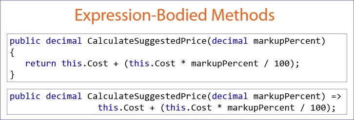

<H1>Method</H1>
* A code block
* Contains a set of programming statements
* Also called a <i>function</i>
 - <b>Method</b> in Object Oriented programming
 - <b>Function</b> in Procedural programming
* **Purpose:** To implement the logic required for specific behavior or functionality in a class

**_Define a <b>method</b> any time there is an operation the application must perform_**


#Building a Method: Signature
##Method Signature
```csharp
public bool PlaceOrder(Product product, int quantity)
```
* Optional accessibility modifier (public)
 - Default is private
* Return type (bool)
 - void if no return value
* Method name (PlaceOrder)
 - PascalCase
 - Verbs
 - If you have trouble naming a method the method might be trying to do too much or its purpose is unclear
* Parameter list
 - Empty parenthesis if no parameters
 - The parenthesis distinguish a method from other class members
 
##XML Document Comment
* Not technically required, but best practice to add
* Identified by ///
* summary for method purpose
* param for a description of each parameter
* VS displays this information as part of intellisense

```csharp
/// <summary>
/// Sends a product order to the vendor.
///</summary>
///<param name="product">Product to order.</param>
///<param name="quantity">Quantity of the product to order.</param>
///<returns></returns>
```

##Best Practices
###<font color="green"*>**DO**</font>:
* Define a meaningful name
* Use a verb
* Use PascalCasing
* Define the most restrictive accessibility possible
* Keep the number of parameters to a minimum
* Define an XML document comment

###<font color="red">**AVOID:**</font>
* Vague terms
* Abbreviations
* Conjunctions (and / or )
* Inconsistent naming


#Building a Method: Body and Return Value
* The method code is defined within a set of curly braces
* The method should begin by validating incoming parameters; often called guard clauses to guard the method from receiving and trying to process invalid parameters

* The method signature defines the type of the return value
 - Return statement must return that type
* Use a type of **void** in the signature if the method does not return a value
 - The return statement can be omitted

##Method Body Best Practices
###<font color="green"*>**DO**</font>:
* Keep methods small / short
 - "The first rule of functions is that they shojuld be small.  The second rule of functions is that they should be smaller than that.  
   Functions shold not be 100 lines long. Functions shoujld hardly ever by 20 lines long. **--Robert Martin** "Clean Code: A Handbook of Agile Software Craftsmanship"
* Use white space
* Use guard clauses
* Return an expected result
 - Use an object to return multiple values
* Implement exception handling

###<font color="red">**AVOID:**</font>
* Using void methods

#Property or Method?
##<b>Property</b>
* Used for data
* Does it describe data?
* Does it execute quickly?

##<b>Method</b>
* Used for operations
* Does it describe processing?
* Does it produce side effects? Change the state of an object
* Does it require parameters?

#Method Overloading
* allows us to define methods with the same name and purpose but with different signatures
 - The method name must be the same
 - The parameters must be different

##Method Overloading Best Practices
###<font color="green"*>**DO**</font>:
* Keep the number of parameters to a minimum
* Keep the order of the parameters consistent
* Define an XML document comment for each overload
* Consider option parameters

###<font color="red">**AVOID:**</font>
* Confusing overloads
* Overloads that differ in purpose
* Duplicating code

#Method Chaining
* Is a technique where one method overload calls another method overload to reduce repeated code between overloads.  One overload will have a majority of the code.

##Method Chaining Best Practices
###<font color="green"*>**DO**</font>:
* Use to minimize repeated code in method overloads
* Consider optional parameters

###<font color="red">**AVOID:**</font>
* If it adds complexity

#Method Overriding
* Override the object or method inherited from above
```csharp
public override string  ToString()
{
  return this.ProductName + " (" + this.productId+")";
}
```
##Method Overriding Best Practices
###<font color="green"*>**DO**</font>:
* Override ToString for each entity class

###<font color="red">**AVOID:**</font>

#Expression-bodied Methods

* Syntax Shortcut
* Single statement methods
* That return a value
* No curly braces
* No return statement
* Just a => this is a <b>lambda operator</b>

##Expression-Bodied Method Best Practices
###<font color="green"*>**DO**</font>:
* Use it for very simple methods

###<font color="red">**AVOID:**</font>
* Using it when there should be guard clauses
* Using it when there should be exception handling