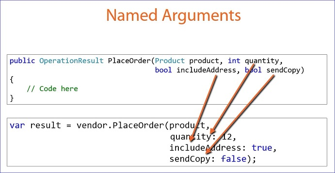
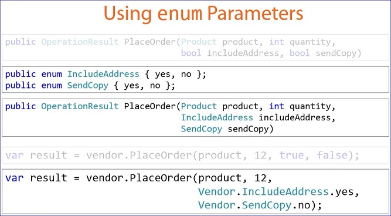
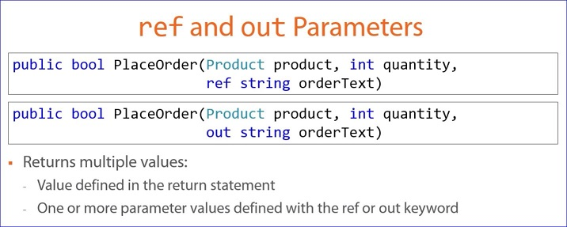

#Improving Parameters in the Method Signature
- Use clear parameter names in the method
- Add XML document comments
- Limit the number of parameters; use only the minimum possible parameters and no more
- Use object types

- Start with the parameters that acted upon or key to the operations
- Required for the operation
- Flags
- Optional parameters

##Improving Methods Best Practices
###<font color="green"*>**DO**</font>:
- Define coherent parameter names
- Define an XML document comment for each paramter
- Keep the number of parameters to a minimum
- Order the parameters in a logical sequence
- Use a consistent parameter order

###<font color="red">**AVOID:**</font>
- Unused parameters

#Named Arguments
- Use the parameter names from the method signature in the method call



- When using named arguments, parameter order doesn't matter
- Not all arguments need to be named
- All named arguments must follow positional arguments

##Named Argument Best Practices
###<font color="green">**DO**</font>:
- Use named arguments as needed for clarity when calling a method

###<font color="red">**AVOID**</font>:
- Unnecessary named arguments
 - For example, when the name of the parameter and argument variable match
 
#Defining Enumerated Parameters
- Using enumerated parameters can clear up the parameters and arguments and elliminate using bool values by using named constants (yes, no).  For example:
```csharp
public enum IncludeAddress { yes, no };
public enum SendCopy { yes, no };
```


##Enum Parameters Best Practices
###<font color="green">**DO**</font>:
- Define a clear name
- Use PascalCasing
-Use enum to represent a set of related values
- Favor enum over a set of constants

###<font color="red">**AVOID**</font>:
- Boolean parameters where possible; consider enum types instead
- Using enum for lists that change often

#Optional Parameters
- Specify a default value in the method signature
- Don't have to be specified when the method is called
- If not specified the default value is used
- Can dramatically reduce the number of overloads necessary
- Must be defined at the end of the parameter list after the required parameters
- When calling the method, if an argument is proviede for any optional parameter, it must also provide arguments for all preceding paramters
 - Or, use named arguments

##Optional Paramter Parameters Best Practices
###<font color="green">**DO**</font>:
- Use optional parameters to minimize overload bloat

###<font color="red">**AVOID**</font>:
- Optional parameters when the parameters are one or the other
- Optional parameters if default cold change and component versioning is important

#ref and out Parameters
- instead of using a Return statement values can be passed back as part of the method parameters



###<b>ref</b>
- Argument passed "by reference"
- Argument variable must be initialized
- Paramter value can be changed in the method
- Changes are reflected in the calling code

###<b>out</b>
- Argument passed "by reference"
- Argument variable must be declared
- Parameter value must be set in the method
- Changes are reflected in the calling code

##ref and out Best Practices
###<font color="green">**DO**</font>:
- Use ref when the method expects an incoming value
- Use out whee the method expects no incoming value

###<font color="red">**AVOID**</font>:
-ref and out where feasible
 - <font color="orange">Return an object instead</font>