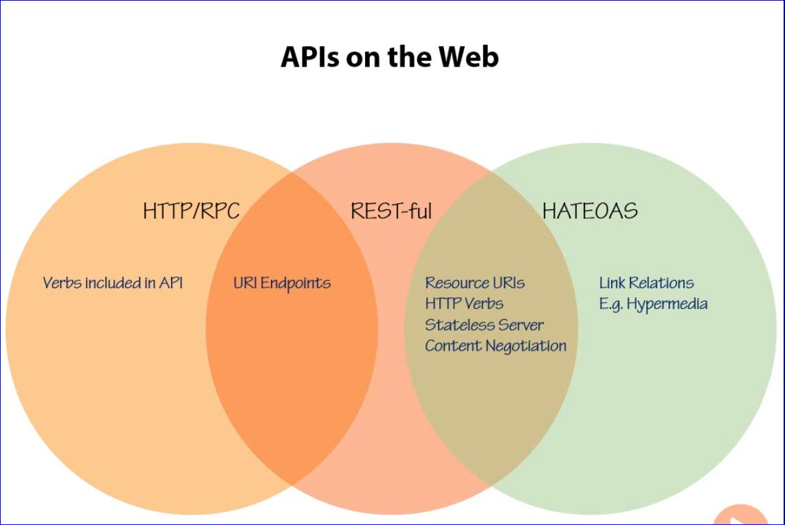

 # Implementing an API in ASP.NET Web Api

## Shawn Wildermuth

### Pragmatic REST

- **REST is a useful set of rules**
  - But can be dogmatic
  - Developers get caught up in ensuring their APIs are completely RESTful
  - Do just enough "REST" to ensure you are gaining the benefit of REST

- There are options for how to implement a RESTful API
  - ASP.NET Web API is one of those options; however, it is a very good option and much easier to deal with than MVC or WCF options.
    - More natural to implement REST
    - Maps Verbs to Methods
    - Encourages separation and mapping
    - More choices for hosting thge API
    - Requires .NET 4.0 or above
  